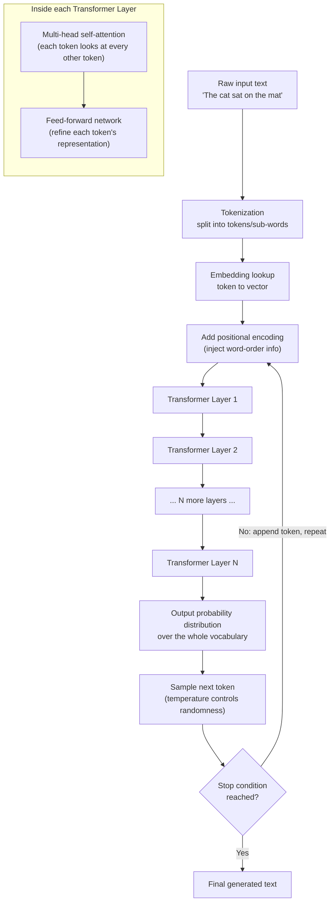
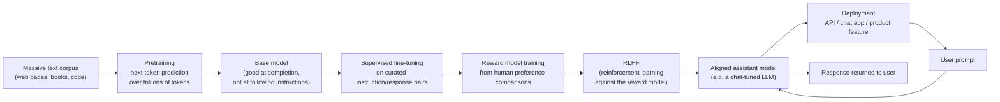
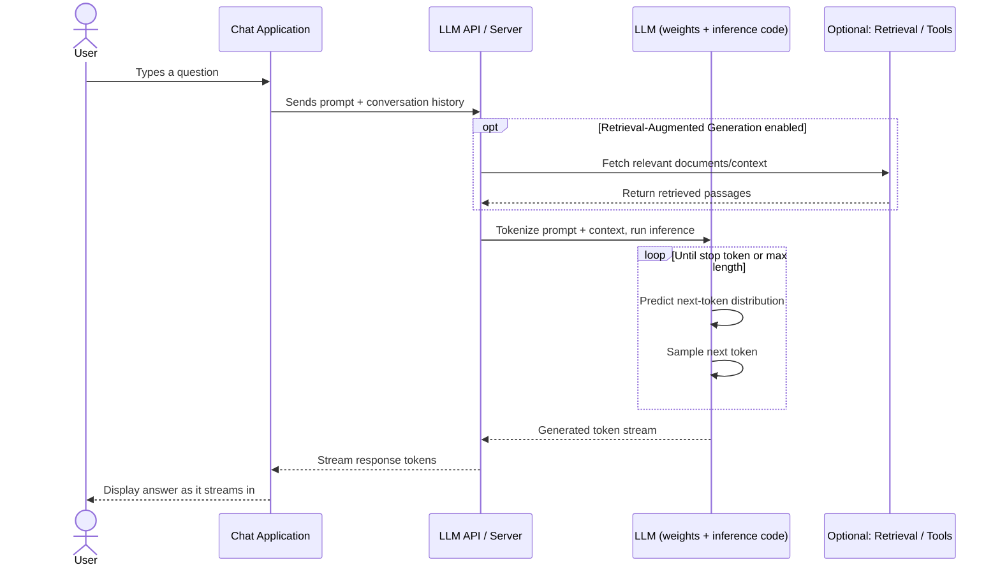

# Introduction to Large Language Models (LLMs)

A complete, self-contained guide to what LLMs are, how they work, why they matter, and how to keep learning after you finish reading this.

## Table of Contents

1. [What Is It?](#what-is-it)
2. [Why It Matters](#why-it-matters)
3. [Where It's Used](#where-its-used)
4. [How It Works](#how-it-works)
5. [Architecture and Workflow Diagrams](#architecture-and-workflow-diagrams)
6. [Key Concepts and Terminology](#key-concepts-and-terminology)
7. [Practical Example: A Prompt's Journey](#practical-example-a-prompts-journey)
8. [Comparisons and Alternatives](#comparisons-and-alternatives)
9. [Common Pitfalls and Misconceptions](#common-pitfalls-and-misconceptions)
10. [Best Practices](#best-practices)
11. [Further Learning Path](#further-learning-path)
12. [References](#references)

---

## What Is It?

**Plain-language definition:** A large language model is a computer program that has read an enormous amount of text and, from that reading, learned the statistical patterns of language well enough to predict what word (or word-fragment) is likely to come next in any given piece of text. Ask it a question, and it writes an answer one small piece at a time by repeatedly guessing "what comes next" based on everything written so far.

**More precise/technical definition:** A large language model (LLM) is a deep learning model, almost always built on the transformer neural network architecture, trained on massive text corpora to perform natural language processing tasks including text generation, summarization, translation, classification, and question answering. IBM describes LLMs as "a category of deep learning models trained on immense amounts of data, making them capable of understanding and generating natural language and other types of content to perform a wide range of tasks." Under the hood, an LLM is a statistical prediction machine: it repeatedly predicts a probability distribution over the next token in a sequence, samples from that distribution, and repeats.

A useful mental model, popularized by AI researcher Andrej Karpathy in his public talks on LLMs, is to think of an LLM as two separate artifacts:

- A **parameters file**: a very large file of numbers (the model's learned "weights"), often hundreds of gigabytes, that encodes everything the model learned during training.
- A **run file**: the relatively small piece of code that loads those parameters and uses them to generate text.

Karpathy has also described training as something like compressing the internet into the parameters file at roughly a 100x compression ratio: a lossy, generalized compression rather than an exact copy, which is why models can produce fluent text about topics without literally quoting a source.

Georgia Tech professor Mark Riedl, writing for a non-technical audience, uses a different, equally useful metaphor: imagine a giant typewriter where every key is a whole word instead of a letter. An LLM is a system that has learned which key is statistically likely to be pressed next given everything typed so far, trained so that its output "could have reasonably appeared on the internet." Riedl's core point, worth internalizing early, is this: your first instinct when an LLM produces something impressive should not be "wow, this must be smart," but rather "I've probably asked it to do something it has seen bits and pieces of before."

## Why It Matters

Before LLMs, software that dealt with human language was brittle. Traditional natural language processing (NLP) systems relied on hand-built rules, keyword matching, or narrow statistical models trained separately for each task (one model for sentiment analysis, another for translation, another for named-entity recognition). Each task required its own labeled dataset and its own engineering effort, and none of these systems could handle language it hadn't been explicitly designed for.

The pain point LLMs solve is **generality**. A single pretrained LLM can perform translation, summarization, coding, question answering, reasoning, and creative writing, often without any task-specific retraining, simply because it learned general-purpose patterns of language and knowledge during pretraining. This shift (from "one narrow model per task" to "one general model, many tasks") is the central reason LLMs triggered the current wave of AI adoption. It parallels how a single well-read, well-spoken human assistant can help with many different kinds of writing and reasoning tasks, rather than needing a different specialist for each one.

The practical effect: tasks that once required teams of engineers building bespoke NLP pipelines, or hours of manual human labor, can now often be handled by writing a well-crafted prompt to an existing model.

## Where It's Used

LLMs have moved from research demos to everyday infrastructure across many industries:

- **Customer support**: chatbots and virtual agents that resolve tickets, draft replies, and triage requests before a human agent gets involved.
- **Software development**: code completion, code review, and debugging assistants (for example, GitHub Copilot and similar coding assistants) built on LLMs.
- **Finance**: fraud detection, document summarization, and research assistance; large financial institutions have integrated LLM-based tools into fraud-reduction workflows.
- **Healthcare**: summarizing clinical notes, drafting patient communications, and assisting with medical literature review (always with human oversight given the stakes of errors).
- **Legal**: contract review and analysis that previously took weeks can be reduced to hours when an LLM does the first pass and a lawyer verifies the output.
- **Retail and logistics**: demand forecasting narratives, product description generation, inventory-related decision support, and customer-facing recommendation chat.
- **Media and marketing**: content drafting, translation, localization, and campaign copy generation.
- **Education**: personalized tutoring, explanation generation, and automated feedback on writing.
- **Search and knowledge work**: question answering over internal company documents (often paired with retrieval, see [RAG](#key-concepts-and-terminology) below), meeting summarization, and email drafting.

Industry surveys report that generative AI usage inside businesses grew sharply through 2025, moving from isolated pilot projects to being embedded directly into sales, support, product development, and everyday knowledge work. The common thread across all these use cases is that LLMs are best at accelerating language-heavy, judgment-assisted work, not at fully replacing human judgment on high-stakes decisions.

## How It Works

At a conceptual level, getting from "a huge pile of internet text" to "a chatbot that can hold a conversation" happens in stages. Each stage answers a different question.

### Step 1: Turn text into numbers a model can process (tokenization and embeddings)

Neural networks operate on numbers, not words. So the first step converts raw text into a sequence of **tokens**, which are typically whole words, sub-words, or punctuation marks (rarely single characters, though it can vary). For example, "unbelievable" might be split into tokens like "un", "believ", and "able." Each token is then mapped to an **embedding**: a list of numbers (a vector) that represents that token's meaning in a high-dimensional space, learned so that tokens with related meanings end up with similar vectors.

### Step 2: Add information about word order (positional encoding)

Unlike older architectures that processed text one word at a time in order (recurrent neural networks), the transformer architecture that powers modern LLMs looks at an entire sequence of tokens at once. Because of this, the model needs an explicit signal for *where* each token sits in the sequence. This is added through **positional encoding**, extra numbers (in the original transformer paper, generated using sine and cosine functions) added to each token's embedding so the model can tell "the cat sat on the mat" apart from "the mat sat on the cat."

### Step 3: Let every token "look at" every other token (self-attention)

This is the core innovation behind transformers, introduced in the 2017 paper "Attention Is All You Need." **Self-attention** lets the model figure out, for each token, how much every other token in the sequence should influence its interpretation. Google's Machine Learning Crash Course gives a classic example: in the sentence "The animal didn't cross the street because it was too tired," attention lets the model correctly connect "it" to "animal" rather than "street," by learning that "animal" is far more relevant context for interpreting "it" in this sentence.

Mechanically, self-attention works by generating three vectors for every token: a **Query** (what am I looking for?), a **Key** (what do I contain?), and a **Value** (what information do I pass along if I'm relevant?). Each token's Query is compared against every other token's Key to produce attention scores, which are turned into weights; those weights are used to blend together the Values of all tokens into a new, context-aware representation. Models don't do this just once: they use **multi-head attention**, running several attention computations in parallel ("heads"), each of which can learn to focus on a different kind of relationship between words (grammar, reference, topic, and so on).

### Step 4: Stack many layers and refine the representation (feed-forward layers)

A single attention step is followed by a small neural network applied independently to each token's representation (a "position-wise feed-forward network"). An attention step plus a feed-forward step makes up one transformer "block" or "layer." Real LLMs stack dozens of these layers on top of each other; each layer refines the token representations a bit further, building up increasingly abstract features, similar in spirit to how layers in an image-recognition network build from edges to shapes to objects.

### Step 5: Predict the next token (the language modeling objective)

After passing through all the layers, the model produces a probability distribution over its entire vocabulary (every possible next token) for the position after the last token in the input. During training, this is done through a **masked prediction** or **next-token prediction** objective: the model is repeatedly shown text with some tokens hidden or with the sequence truncated, and it is trained to predict the missing or next token, comparing its guess against the real answer and adjusting its internal parameters (via backpropagation and gradient descent) to make similar guesses better in the future. Do this across (in the case of frontier models) trillions of tokens of text, and the model gradually absorbs grammar, facts, reasoning patterns, and writing styles, purely as a side effect of getting better and better at the single task of predicting the next token.

### Step 6: Generate text one token at a time (inference / decoding)

Once trained, using the model ("inference") works by feeding it a prompt, having it predict a probability distribution for the next token, sampling one token from that distribution (a **temperature** setting controls how random or conservative this sampling is), appending that token to the sequence, and repeating the whole process to generate the next token, and the next, until a stop condition is reached. This is why LLMs can feel like they are "typing" a response: they genuinely are generating it sequentially, one token at a time, each new token conditioned on everything generated so far.

### Step 7: Turn a raw text-predictor into a helpful assistant (fine-tuning and RLHF)

A model trained purely on next-token prediction over internet text is called a **base model**. Base models are good at continuing text patterns but are not naturally good at following instructions or refusing harmful requests; left alone, a base model asked a question might just continue the pattern of a webpage (for example, listing more similar questions) rather than answering it. To turn a base model into an assistant like ChatGPT, Claude, or Gemini, providers apply additional training stages:

1. **Supervised fine-tuning (SFT)**: the model is further trained on curated examples of good instruction-following conversations (a prompt paired with a high-quality human-written or human-approved response).
2. **Reward modeling**: human labelers compare pairs of model outputs and indicate which one they prefer; these preferences train a separate **reward model** that learns to score outputs the way a human would.
3. **Reinforcement learning from human feedback (RLHF)**: the assistant model then generates responses, the reward model scores them, and an RL algorithm (commonly Proximal Policy Optimization, PPO) nudges the assistant's behavior to produce more highly-scored responses over time.

This process is what makes an LLM "aligned": more likely to be helpful, honest, and to decline clearly harmful requests, rather than simply continuing text patterns in the most statistically likely (but not necessarily most useful or safe) way.

## Architecture and Workflow Diagrams

### Diagram 1: How a transformer processes and generates text



This diagram traces one full pass: text becomes tokens, tokens become vectors, vectors flow through repeated attention and feed-forward layers, and the final layer outputs a probability distribution that gets sampled to produce the next word. This entire loop repeats for every new token generated, which is why longer responses take proportionally longer to produce.

### Diagram 2: How a raw base model becomes a deployed chat assistant



This diagram shows the two very different phases of an LLM's life: **pretraining**, which builds broad language and world knowledge from raw text, and **post-training** (SFT + reward modeling + RLHF), which shapes that broad knowledge into helpful, safe, instruction-following behavior. Skipping the second phase is why a "raw" base model behaves very differently from a product like ChatGPT built on top of it.

### Diagram 3: A single user request as a sequence diagram



This view is useful for understanding what happens architecturally when you use a product like ChatGPT or an internal company chatbot: your message rarely goes straight into "the model" with nothing else; it usually passes through an application layer, sometimes a retrieval step, and then the model itself, which generates its answer token by token and streams it back.

## Key Concepts and Terminology

| Term | Plain-language meaning |
|---|---|
| **Token** | A chunk of text (often a word, part of a word, or punctuation mark) that a model treats as one unit. Model limits and pricing are usually measured in tokens, not words or characters. |
| **Tokenization** | The process of splitting raw text into tokens before feeding it to a model. |
| **Embedding** | A list of numbers (a vector) that represents a token's or a piece of text's meaning, learned so that similar meanings end up as similar vectors. |
| **Parameters (weights)** | The numbers inside a neural network that were adjusted during training. "Billions of parameters" means billions of these tunable numbers; more parameters generally (but not always) means more capacity to learn patterns. |
| **Transformer** | The neural network architecture, introduced in 2017, that underlies virtually all modern LLMs. Its defining feature is self-attention. |
| **Self-attention** | The mechanism that lets a model weigh how much every token in a sequence should influence the interpretation of every other token. |
| **Multi-head attention** | Running several self-attention computations in parallel so different "heads" can learn different kinds of relationships between tokens. |
| **Encoder / Decoder** | The two structural halves of the original transformer. Encoders build a representation of input text (used in bidirectional, understanding-focused models); decoders generate output text one token at a time (used in generative models like GPT). Many modern LLMs are decoder-only. |
| **Context window** | The maximum number of tokens (input plus output combined, in most implementations) a model can "see" or reason over at once. Anything outside the window is invisible to the model. |
| **Pretraining** | The initial, extremely large-scale training phase where a model learns general language patterns from a huge, mostly unlabeled text corpus using next-token or masked-token prediction. |
| **Fine-tuning** | Additional, smaller-scale training on top of a pretrained model, using a narrower dataset to specialize its behavior (for example, instruction-following, a specific domain, or a specific tone). |
| **RLHF (Reinforcement Learning from Human Feedback)** | A post-training technique that uses human preference comparisons to train a reward model, then uses reinforcement learning to steer the LLM toward outputs humans rate more highly. |
| **Base model vs. instruct/chat model** | A base model only continues text patterns; an instruct or chat model has gone through additional fine-tuning (and often RLHF) specifically to follow instructions and hold conversations helpfully and safely. |
| **Prompt** | The text input given to a model, including instructions, questions, or context, that the model conditions its response on. |
| **Prompt engineering** | The practice of deliberately crafting prompts (wording, structure, examples, and constraints) to reliably get better or more predictable outputs from a model. |
| **Temperature** | A sampling parameter controlling randomness. Low temperature (near 0) makes outputs more deterministic and focused; high temperature (closer to 1 or above) makes outputs more varied and creative, at the cost of predictability. |
| **Hallucination** | When a model generates fluent, confident-sounding text that is factually wrong or entirely fabricated. This happens because the model is optimized to produce plausible next tokens, not to verify truth, and it has no built-in mechanism to know what it doesn't know. |
| **Retrieval-Augmented Generation (RAG)** | An architecture pattern where relevant documents are fetched from an external knowledge source (often a vector database) and inserted into the prompt before generation, grounding the model's answer in real, checkable sources and reducing hallucination. |
| **Emergent abilities** | Capabilities (such as multi-step reasoning or reliable arithmetic) that are barely present in smaller models but appear fairly suddenly once a model crosses a certain scale threshold, rather than improving smoothly and predictably. |
| **Scaling laws** | Empirically observed, roughly power-law relationships showing that a model's loss (how well it predicts held-out text) improves predictably as model size, dataset size, and training compute all increase together. |
| **Parameter count** | The number of learnable weights in a model (for example, "7B" means roughly 7 billion parameters). Larger is not automatically better; data quality and training technique matter enormously too. |
| **Instruction tuning** | A form of fine-tuning specifically focused on teaching a model to follow natural-language instructions rather than just continue text. |
| **Multimodal model** | An LLM (or related model) extended to handle inputs and/or outputs beyond text, such as images, audio, or video, within the same architecture. |
| **Agent / tool use** | An LLM-based system that can, in addition to generating text, decide to call external tools or functions (search, calculators, code execution, APIs) and incorporate the results into its reasoning before responding. |

## Practical Example: A Prompt's Journey

Walking through a concrete example ties the concepts above together. Suppose a user types this into a chat assistant:

```text
Summarize the following meeting notes in 3 bullet points:

"We discussed the Q3 roadmap. Marketing wants to launch the campaign
in August. Engineering flagged that the API redesign will slip by two
weeks. We agreed to revisit timelines next Monday."
```

Here is what happens, step by step, connecting back to the [How It Works](#how-it-works) section:

1. **Tokenization**: The application splits this prompt into tokens (roughly 45-60 tokens, depending on the model's tokenizer), including the instruction text and the meeting notes.
2. **Embedding + positional encoding**: Each token is converted into a vector, and positional information is added so the model knows "Q3" appears before "August," and "Engineering" is a separate clause from "Marketing."
3. **Attention across layers**: As the tokens pass through the model's layers, self-attention lets the word "slip" attend strongly to "API redesign" and "two weeks" (so it understands what is slipping and by how much), while "launch" attends to "campaign" and "August." Multiple layers build up an increasingly rich understanding of who did what, and how the pieces relate to the instruction ("summarize in 3 bullet points").
4. **Next-token prediction (generation)**: The model doesn't decide on all three bullet points at once. It generates the first bullet point's first token, then the next, then the next, each time re-running the whole forward pass conditioned on everything generated so far, until it produces something like:
   ```text
   - Marketing plans to launch the campaign in August.
   - Engineering's API redesign will be delayed by two weeks.
   - The team will revisit the project timeline next Monday.
   ```
5. **Sampling/temperature**: If temperature is low, the model tends to produce the most probable, fairly literal summary each time you ask. If temperature is high, wording may vary more between runs, even for the same input.
6. **Where this could go wrong**: If the notes had been much longer than the model's context window, the tail end would simply not be seen by the model at all. And if the user had instead asked a question the notes didn't answer (for example, "what's the total marketing budget?"), a model without retrieval or tool access might still confidently produce a plausible-sounding but fabricated number, a hallucination, rather than saying "the notes don't mention a budget."

This same pattern (tokenize, embed, attend across layers, predict token by token, sample) is what happens whether the input is meeting notes, a coding question, or a request to write a poem. Only the content of what gets attended to, and the length of the generated response, changes.

## Comparisons and Alternatives

### LLMs vs. earlier NLP approaches

| Aspect | Rule-based / classic NLP | Task-specific statistical ML (pre-2018) | Large Language Models |
|---|---|---|---|
| Generality | Narrow, hand-coded for one task | Narrow, one model per task | Broad, one model handles many tasks |
| Data needs per task | Rules written by experts | Labeled dataset per task | Little to no task-specific labeled data (prompting or light fine-tuning) |
| Handles novel phrasing | Poorly (relies on exact patterns) | Moderately (depends on training data) | Well, due to broad pretraining |
| Maintenance | High (rules break easily) | Moderate (retrain per task) | Lower per-task, but the underlying model itself is costly to build/update |
| Typical failure mode | Missed inputs outside the rules | Overfitting to training distribution | Fluent but sometimes factually wrong ("hallucination") |

### LLMs vs. search engines

A search engine retrieves and ranks existing documents; it does not generate new text, and its "understanding" of a query is limited to matching and ranking, not synthesis. An LLM synthesizes a novel answer by generating text token by token based on patterns learned in training, which means it can combine and explain information in ways a search engine cannot, but also means it can produce confident, plausible-sounding answers that are not backed by any single retrievable source (hence the hallucination risk). Many modern products combine both: a search or retrieval step (RAG) supplies the LLM with grounded source material, and the LLM's generative ability turns that material into a fluent, direct answer.

### LLMs vs. classic (non-language) machine learning

Traditional ML models (for example, a logistic regression predicting loan default, or a decision tree classifying spam) are typically trained on structured, tabular data for one specific prediction task and output a number or category. LLMs are trained on unstructured text for the general task of next-token prediction and output more text. LLMs can be adapted to do classification-style tasks (by prompting them to answer "yes/no" or a category), but a dedicated classic ML model trained on the specific task's data will often be cheaper, faster, and more accurate for narrow, well-defined structured prediction problems.

### Open-weight vs. closed/proprietary LLMs

| Aspect | Closed/proprietary (for example, GPT, Claude, Gemini families) | Open-weight (for example, Llama, Mistral, Qwen families) |
|---|---|---|
| Access | Via hosted API only | Weights downloadable, can run locally or self-host |
| Customization | Limited to prompting and provider-supported fine-tuning | Full fine-tuning, quantization, and architecture-level experimentation possible |
| Cost model | Usage-based API pricing | Infrastructure/hosting cost, no per-token API fee |
| Data privacy | Data typically sent to provider's servers | Can be run fully in your own environment |
| Bleeding-edge capability | Usually leads on the largest, most capable models | Often close behind, with a widening range of strong smaller models |

## Common Pitfalls and Misconceptions

1. **"The model understands and believes what it says."** LLMs do not have beliefs, intentions, or a model of truth. They generate the statistically likely continuation of a prompt. A model can state something false with exactly the same fluent confidence as something true, because fluency and correctness are not the same optimization target.
2. **"Bigger always means better."** Parameter count correlates with capability on average, but data quality, training technique (including RLHF), and task fit often matter more for a specific use case than raw size. A well-tuned smaller model can outperform a larger, poorly-tuned one on a specific task.
3. **"The model has real-time knowledge."** A base LLM only knows what was in its training data up to its training cutoff date. Without retrieval or tool access, it cannot know about events after that cutoff, and it cannot browse the live internet unless the product wrapping it explicitly adds that capability.
4. **"Hallucinations are rare edge cases."** Hallucination is a structural property of how LLMs generate text (next-token prediction without a built-in truth-check), not a rare bug. It is more likely for obscure facts, precise numbers, citations, and anything outside the training data's coverage. Always verify high-stakes factual claims.
5. **"A longer, more detailed prompt is always better."** Extremely long or unfocused prompts can dilute attention across irrelevant details and increase the chance the model misses the actual instruction. Clear, structured prompts usually outperform long, meandering ones.
6. **"The chat interface I use is 'the whole model.'** A production chat assistant is typically the LLM plus a surrounding application: safety filters, system prompts, retrieval systems, conversation memory management, and tool integrations. The raw model's behavior can differ substantially from the product experience.
7. **"Emergent abilities mean the model is 'waking up' or becoming generally intelligent."** Emergent abilities are a measurement phenomenon: some capabilities happen to look like a sudden jump on certain benchmarks when a model crosses a scale threshold, but this reflects how a specific metric is scored, not evidence of general intelligence or self-awareness.
8. **"Prompt engineering is a one-time skill."** Different model families and even different versions of the same model respond differently to the same prompt structure. Prompts often need to be re-tested when switching or upgrading models.

## Best Practices

- **Be explicit and structured in prompts.** State the task, the desired format, and any constraints clearly rather than relying on the model to infer intent. Providing a short example of the desired output ("few-shot prompting") often improves reliability.
- **Ground high-stakes answers with retrieval.** For anything where factual accuracy matters (compliance, legal, medical, financial), pair the LLM with a retrieval step (RAG) over a trusted, current knowledge source rather than relying on the model's memorized training data alone.
- **Always verify before acting on critical outputs.** Treat LLM output as a strong first draft produced by a well-read assistant, not as verified fact, especially for citations, statistics, legal clauses, or code that will run in production.
- **Match model size and cost to the task.** Use smaller, cheaper, faster models for simple, high-volume tasks (classification, short summarization) and reserve larger, more expensive models for tasks that genuinely need deeper reasoning.
- **Set temperature deliberately.** Use low temperature for tasks requiring consistency and precision (data extraction, code generation) and higher temperature for tasks that benefit from variety (brainstorming, creative writing).
- **Mind the context window.** Long documents or conversations can silently exceed a model's context window; when that happens, older content is dropped or truncated, often invisibly to the user, which can degrade output quality without an obvious error message.
- **Never send sensitive/regulated data to a hosted API without checking your data policy.** Confirm what the provider does with input data (training reuse, retention period) before sending confidential information, and prefer self-hosted or enterprise-agreement options when required by compliance.
- **Keep a human in the loop for consequential decisions.** LLMs are decision-support tools, not decision-makers, in domains like healthcare, hiring, lending, or legal judgment, where an error has real consequences for real people.
- **Version and test your prompts like code.** Treat prompts used in production systems as versioned artifacts with regression tests, since small wording changes, or model upgrades, can silently change behavior.

## Further Learning Path

A sensible order to go deeper after this file, roughly easiest to most technical:

1. **Mark Riedl's "A Very Gentle Introduction to Large Language Models (without the Hype)"** for a metaphor-driven, non-technical mental model (start here if the "How It Works" section above still feels abstract).
2. **Google's Machine Learning Crash Course - LLMs and Transformers module** for a slightly more technical, guided walkthrough with diagrams of encoders, decoders, and attention.
3. **IBM's "What Are Large Language Models" overview** for a business- and use-case-oriented perspective, useful if your goal is applying LLMs rather than building them.
4. **The Hugging Face LLM Course** (free, hands-on, code-first) to move from concepts to actually loading, prompting, and fine-tuning real models using the `transformers` library. Start at Chapter 1 and work through at your own pace; the course is organized into a Transformers-library foundation (chapters 1-4), datasets/tokenizers/classic NLP tasks (chapters 5-8), model sharing (chapter 9), and advanced LLM topics like fine-tuning (chapters 10-12).
5. **Andrej Karpathy's "Intro to Large Language Models" and "Deep Dive into LLMs like ChatGPT" talks** (both referenced in the seed material for this guide) for a deeper, code-and-diagram-supported explanation of training, inference, and the practical mental models Karpathy uses when reasoning about LLM capability and safety. These are long-form video talks; watch them once you're comfortable with the vocabulary in this README's [glossary](#key-concepts-and-terminology).
6. **The original "Attention Is All You Need" paper (Vaswani et al., 2017)** once you want the primary source for the transformer architecture itself, ideally after reading at least one plain-language walkthrough of self-attention first.
7. **Hands-on practice**: use a free-tier hosted LLM API or an open-weight model (Llama, Mistral, or similar) running locally, and experiment with prompt structure, temperature, and (if you're ready) a simple RAG pipeline over your own documents.
8. **Deeper topics once comfortable**: scaling laws and emergent abilities research, RLHF and alignment techniques, quantization and efficient inference, multimodal models, and agentic tool-use patterns.

## References

### User-provided seed resources

These were supplied as starting points. The three YouTube videos could not be transcribed or directly consumed by the research tools used to write this guide; they are cited here for attribution, with their subject matter identified through web search rather than by watching the videos, as instructed.

- [Andrej Karpathy, "[1hr Talk] Intro to Large Language Models"](https://www.youtube.com/watch?v=zjkBMFhNj_g) - identified via cross-reference (an Internet Archive mirror of this exact video ID is catalogued under this title); covers LLM basics (training, inference, fine-tuning into an assistant), the future of LLMs (scaling and multimodality), and LLM security (jailbreaks, prompt injection, data poisoning). Content in this README's discussion of the "parameters file / run file" mental model and the "compression of the internet" analogy is attributed to Karpathy's public talks on this subject.

- [Andrej Karpathy, "Deep Dive into LLMs like ChatGPT"](https://www.youtube.com/watch?v=7xTGNNLPyMI) - identified via web search results describing this video as covering the full training stack behind LLMs and practical mental models for using them; no direct transcript was consulted, so technical claims in this README are sourced from the text references below rather than this video.
- [Google Machine Learning Crash Course: Large language models - Transformers](https://developers.google.com/machine-learning/crash-course/llm/transformers) - primary source for the explanation of encoders, decoders, self-attention, and multi-head attention in this guide.
- [IBM Think: What Are Large Language Models (LLMs)?](https://www.ibm.com/think/topics/large-language-models) - primary source for the plain-language and technical definitions, and for use-case/industry framing.
- [Mark Riedl, "A Very Gentle Introduction to Large Language Models without the Hype"](https://mark-riedl.medium.com/a-very-gentle-introduction-to-large-language-models-without-the-hype-5f67941fa59e) - primary source for the "giant typewriter" metaphor and the "seen bits and pieces of before" framing used in this guide.
- [Hugging Face LLM Course, Chapter 1](https://huggingface.co/learn/llm-course/en/chapter1/1) - primary source for the course roadmap referenced in the Further Learning Path, and for the encoder/decoder/encoder-decoder distinction.
- [r/LocalLLaMA Reddit thread pointing to Karpathy's "Intro to Large Language Models"](https://www.reddit.com/r/LocalLLaMA/comments/181wiqg/intro_to_large_language_models_andrew_karpathy/) - seed pointer that led to researching Karpathy's talk described above.

- [LLM Visualization](https://bbycroft.net/llm) - A visualization diagram shows the structure of an LLM and how data flows in it.

### Independent research (used to expand beyond the seed material)

- [Attention Is All You Need - transformer architecture explainer](https://levelup.gitconnected.com/attention-is-all-you-need-understanding-the-transformer-model-10519074916f) - background on the original 2017 transformer paper's architecture.
- [Codecademy: Transformer Architecture Explained With Self-Attention Mechanism](https://www.codecademy.com/article/transformer-architecture-self-attention-mechanism) - supporting detail on Query/Key/Value mechanics and positional encoding.
- [Turing: Reinforcement Learning from Human Feedback (RLHF) in LLMs](https://www.turing.com/resources/rlhf-in-llms) - primary source for the RLHF explanation (SFT, reward modeling, PPO fine-tuning) used in this guide.
- [Medium: Fine-Tuning LLMs with Human Feedback (RLHF), Latest Techniques and Best Practices](https://medium.com/@meeran03/fine-tuning-llms-with-human-feedback-rlhf-latest-techniques-and-best-practices-3ed534cf9828) - cross-check source for the RLHF pipeline description.
- [Center for Security and Emerging Technology: Emergent Abilities in Large Language Models, An Explainer](https://cset.georgetown.edu/article/emergent-abilities-in-large-language-models-an-explainer/) - source for the emergent abilities and scaling laws discussion.
- [Domo: The AI Glossary, Demystifying Terms You Need to Know](https://www.domo.com/blog/the-ai-glossary-demystifying-terms-you-need-to-know) - cross-check source for glossary definitions (context window, hallucination, RAG, temperature, tokenization).
- [AssemblyAI: 7 LLM Use Cases and Applications](https://www.assemblyai.com/blog/llm-use-cases) - source for industry use-case examples.
- [Instinctools: 25+ LLM Use Cases and Applications Across Industries](https://www.instinctools.com/blog/llm-use-cases/) - cross-check source for industry adoption figures and examples (JPMorgan Chase, Walmart, UnitedHealth, FedEx).

---

*This guide was written to be self-contained: if you have read it end to end, including the diagrams and glossary, you should be able to hold an informed conversation about what LLMs are, how they work at a conceptual and architectural level, and where to go next to build hands-on skills.*