# OLTP vs OLAP: A Complete Guide

A self-contained reference on the two foundational database processing models: **OLTP (Online Transaction Processing)** and **OLAP (Online Analytical Processing)**. Read this once and you should not need to look anywhere else to understand what they are, how they work, when to use each, and how modern systems combine them.

## Table of Contents

1. [Introduction](#1-introduction)
2. [What Is OLTP?](#2-what-is-oltp)
3. [What Is OLAP?](#3-what-is-olap)
4. [Side-by-Side Comparison](#4-side-by-side-comparison)
5. [Visual Comparison (Infographic)](#5-visual-comparison-infographic)
6. [Data Modeling: Normalized vs Denormalized](#6-data-modeling-normalized-vs-denormalized)
7. [Storage Structure: Row-Oriented vs Column-Oriented](#7-storage-structure-row-oriented-vs-column-oriented)
8. [When to Use Which](#8-when-to-use-which)
9. [How They Work Together in the Real World](#9-how-they-work-together-in-the-real-world)
10. [Hybrid Approaches: HTAP](#10-hybrid-approaches-htap)
11. [Quick Reference Cheat Sheet](#11-quick-reference-cheat-sheet)
12. [Further Reading](#12-further-reading)

---

## 1. Introduction

Every piece of software that stores data eventually has to answer two very different kinds of questions:

- **"What is happening right now, for this one customer?"** (Did the payment go through? Is the seat still available? Update this row.)
- **"What has been happening overall, across millions of customers, over the last two years?"** (What is our revenue trend by region? Which products are most profitable? Scan and aggregate billions of rows.)

The first kind of question is answered by **OLTP** systems. The second kind is answered by **OLAP** systems. They are optimized for opposite workloads, which is why almost no serious system tries to use a single, unmodified design for both. Understanding this split explains why companies run separate databases, why data warehouses exist, why "the report is slow" is not a bug in your app database, and why terms like ETL, data warehouse, star schema, and HTAP exist in the first place.

---

## 2. What Is OLTP?

### 2.1 Definition

**OLTP (Online Transaction Processing)** is a class of database system designed to manage a high volume of short, real-time transactions: inserting, updating, deleting, and reading small amounts of data, usually a few rows at a time, on behalf of many concurrent users.

Think of OLTP as the system of record for "what is true right now." Every time you swipe a card, book a flight seat, add an item to a cart, or update your profile, an OLTP system is handling that request, typically in milliseconds.

### 2.2 How OLTP Works

OLTP systems are built around the **transaction**: a unit of work that must be completed entirely or not at all. This is enforced through **ACID** properties:

| Property | Meaning |
|---|---|
| **Atomicity** | A transaction either fully completes or fully rolls back. No partial updates. |
| **Consistency** | A transaction can only move the database from one valid state to another (constraints, keys, and rules are never violated). |
| **Isolation** | Concurrent transactions do not interfere with each other, even though they run at the same time. |
| **Durability** | Once committed, a transaction survives crashes, power loss, or restarts. |

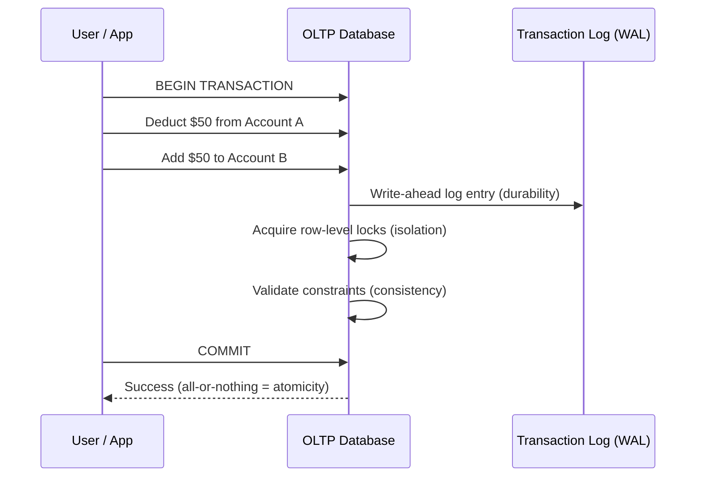

This diagram is the classic "transfer money between two accounts" example: both the debit and the credit must succeed together, or neither should happen. That guarantee is the essence of OLTP.

### 2.3 Underlying Data Structure

- **Row-oriented storage**: an entire row (e.g., one customer's full record: id, name, email, address, balance) is stored contiguously on disk. This is efficient because a typical OLTP query needs *most or all columns of one specific row* ("get me everything about order #4471").
- **Normalized schema (usually 3NF)**: data is split into many small, related tables to eliminate redundancy. A `customers` table, an `orders` table, and an `order_items` table are linked by foreign keys instead of repeating customer details on every order row. This keeps writes fast and consistent (update a customer's address once, everywhere sees it).
- **Indexes**: B-tree or hash indexes on primary/foreign keys make single-row lookups nearly instant.
- **Locking and concurrency control**: row-level or page-level locks (or MVCC, as in PostgreSQL) let thousands of users read and write at once without corrupting data.

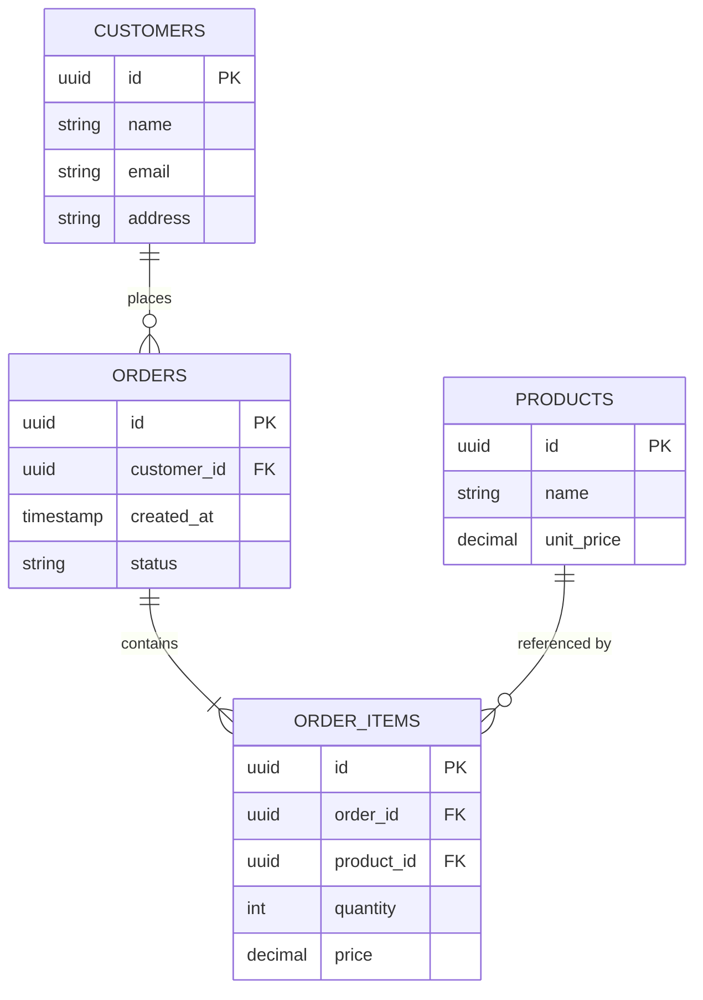

Notice how normalized this is: customer info lives in exactly one place, product info lives in exactly one place, and everything else references it by ID. This avoids duplicate or conflicting data, which is critical when the same data is being updated constantly by many users.

### 2.4 Key Characteristics

| Characteristic | Description |
|---|---|
| Query type | Simple: `INSERT`, `UPDATE`, `SELECT * WHERE id = ?` |
| Data volume per operation | Small (a handful of rows) |
| Data volume overall | Megabytes to low terabytes |
| Response time | Milliseconds (typically sub-50ms) |
| Concurrency | Thousands of simultaneous short transactions |
| Data freshness | Real-time, always current |
| Users | Front-line staff, application end-users, customer-facing systems |
| Backup frequency | Frequent (data loss is costly and immediate) |
| Availability need | Very high; downtime blocks live business operations |

### 2.5 Real-World Examples

- **Banking**: ATM withdrawals, fund transfers, balance checks
- **E-commerce**: shopping carts, checkout, inventory decrement
- **Airlines**: seat reservations, ticket booking
- **Retail POS**: in-store checkout systems
- **SaaS applications**: user sign-up, profile updates, session management

Common technologies: PostgreSQL, MySQL, Oracle Database, Microsoft SQL Server, Amazon Aurora, and MongoDB (for document-style OLTP workloads).

---

## 3. What Is OLAP?

### 3.1 Definition

**OLAP (Online Analytical Processing)** is a class of database system designed to run complex queries over large volumes of historical, often aggregated, data, so that analysts, data scientists, and executives can spot trends, build reports, and make decisions.

Think of OLAP as the system that answers "what does the big picture look like?" It does not care about a single order; it cares about total revenue by month, by region, by product category, sliced and diced from every angle at once.

### 3.2 How OLAP Works

OLAP systems typically do not serve live application traffic. Instead, data flows into them from one or more OLTP systems (and other sources), gets transformed and reshaped for analysis, and is then queried by reporting and BI tools.

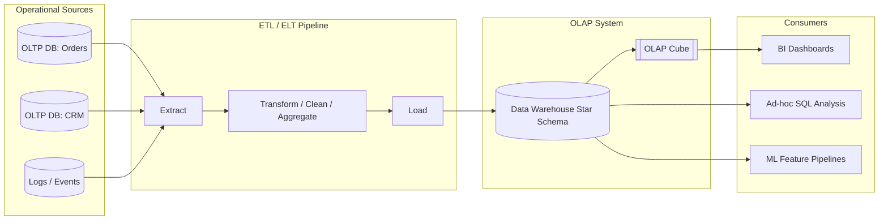

This ETL (Extract, Transform, Load) or ELT (Extract, Load, Transform) pipeline is the backbone of most analytics stacks: it periodically (or continuously, in modern streaming setups) copies data out of transactional systems into a structure optimized for reading and aggregating, not for fast single-row writes.

### 3.3 Underlying Data Structure

- **Column-oriented storage**: values from the same column across many rows are stored together. This is efficient because a typical OLAP query touches only a few columns (e.g., `region`, `sale_amount`, `date`) but scans millions of rows. Columnar storage also compresses extremely well (a column of repeated country codes compresses far better than a mixed row of unrelated fields).
- **Denormalized schema (star or snowflake schema)**: instead of many small normalized tables, OLAP systems use a **fact table** (the measurements: sales amount, quantity, revenue) surrounded by **dimension tables** (the context: time, customer, product, region). This trades some redundancy for dramatically simpler and faster aggregation queries.
- **OLAP cubes**: a conceptual (and sometimes literal) multidimensional structure that pre-aggregates measures across combinations of dimensions (time x region x product), so questions like "total sales in Q3 in the Northeast for Electronics" can be answered almost instantly.
- **Aggregation and indexing strategies**: materialized views, pre-computed rollups, sparse indexing, and data-skipping indexes (used by engines like ClickHouse and Snowflake) minimize the amount of data scanned per query.

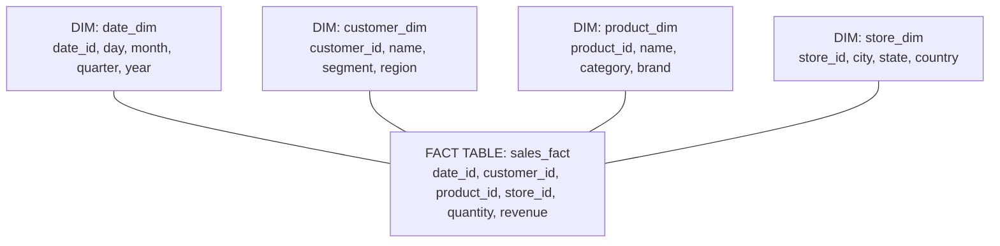

This is a **star schema**: one central fact table surrounded by dimension tables, named for the star-like shape when diagrammed. A **snowflake schema** is the same idea, except the dimension tables are further normalized into sub-tables (e.g., `product_dim` splits into `product_dim` and `brand_dim`), trading a little query simplicity for less redundancy.

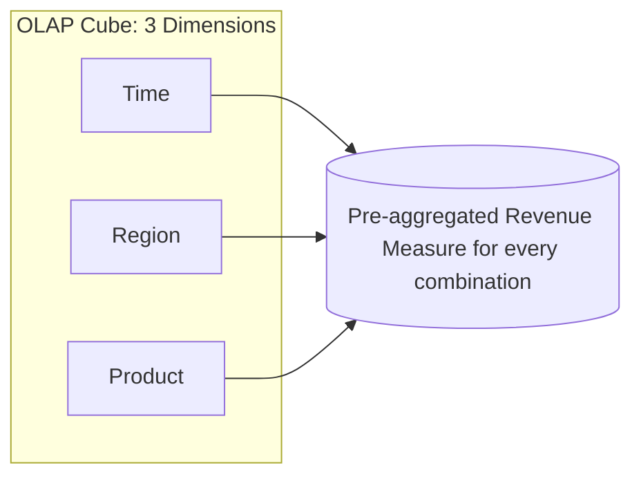

An OLAP cube lets analysts "slice" (pick one value of a dimension), "dice" (pick a sub-cube), "drill down" (go from year to quarter to month), and "roll up" (go from city to state to country), all against pre-aggregated data instead of recomputing from raw rows every time.

### 3.4 Key Characteristics

| Characteristic | Description |
|---|---|
| Query type | Complex: multi-table joins, `GROUP BY`, aggregations, window functions |
| Data volume per operation | Large (thousands to billions of rows scanned) |
| Data volume overall | Terabytes to petabytes |
| Response time | Seconds to minutes (occasionally longer for huge ad-hoc scans) |
| Concurrency | Fewer simultaneous users, but each runs heavier queries |
| Data freshness | Periodic (batch, hourly, daily) or near-real-time in modern streaming setups |
| Users | Data analysts, data scientists, executives, BI tools |
| Backup frequency | Less frequent (data is often derived and reproducible from source systems) |
| Availability need | High but generally more tolerant of brief downtime than OLTP |

### 3.5 Real-World Examples

- **Retail and e-commerce**: sales trend analysis, demand forecasting, customer segmentation
- **Streaming platforms**: Netflix and Spotify's recommendation and personalization engines analyze historical viewing/listening data
- **Banking and finance**: fraud pattern detection across millions of historical transactions, risk modeling
- **Healthcare**: analyzing patient outcomes, readmission rates, and treatment effectiveness across large populations
- **Marketing**: campaign performance, attribution analysis, churn prediction

Common technologies: Snowflake, Amazon Redshift, Google BigQuery, ClickHouse, Apache Druid, Microsoft Analysis Services, and traditional data warehouse tools built on top of Oracle or SQL Server.

---

## 4. Side-by-Side Comparison

| Dimension | OLTP | OLAP |
|---|---|---|
| **Full name** | Online Transaction Processing | Online Analytical Processing |
| **Primary purpose** | Run the business (day-to-day operations) | Understand the business (analysis and decisions) |
| **Typical user** | Front-line staff, application/API users | Analysts, data scientists, executives |
| **Query pattern** | Short, simple, high-frequency (read/write single rows) | Long, complex, lower-frequency (aggregate many rows) |
| **Data source** | Original, current, operational data | Historical, aggregated data pulled from OLTP and other sources |
| **Data volume handled per query** | A few rows | Thousands to billions of rows |
| **Storage orientation** | Row-oriented | Column-oriented |
| **Schema design** | Normalized (3NF), many small tables | Denormalized, star or snowflake schema |
| **Update pattern** | Frequent, real-time, small transactions | Periodic, batch (or streaming), bulk loads |
| **Response time** | Milliseconds | Seconds to minutes |
| **Concurrency model** | High concurrency, short-lived transactions | Lower concurrency, long-running queries |
| **Data integrity mechanism** | ACID transactions, foreign keys, constraints | Consistency enforced upstream; reads can tolerate slight staleness |
| **Backup and recovery** | Frequent, critical (data loss = lost business) | Less frequent; often re-derivable from source systems |
| **Storage size** | Megabytes to low terabytes | Terabytes to petabytes |
| **Example systems** | PostgreSQL, MySQL, Oracle, SQL Server, Aurora | Snowflake, BigQuery, Redshift, ClickHouse, Druid |
| **Example question answered** | "What is customer #123's current balance?" | "What was our average order value by region last quarter?" |

---

## 5. Visual Comparison (Infographic)

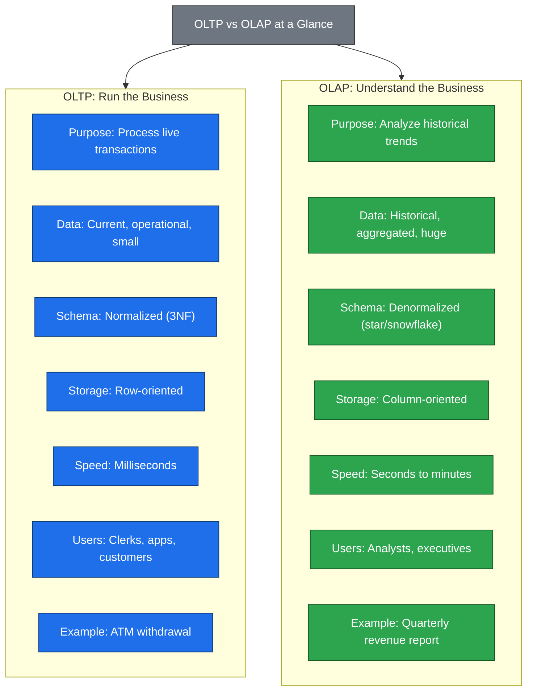

---

## 6. Data Modeling: Normalized vs Denormalized

OLTP and OLAP make opposite trade-offs on the classic database design spectrum: **redundancy vs simplicity**.

- **OLTP normalizes** (typically to Third Normal Form, 3NF) to eliminate duplicate data. Every fact lives in exactly one place, so updates are cheap, fast, and never create inconsistency. The cost is that reading a "full picture" of something requires joining many tables.
- **OLAP denormalizes** deliberately. It flattens data into fact and dimension tables so that reporting queries touch fewer tables and can aggregate huge volumes quickly, at the cost of some redundancy and the need for a controlled load process (ETL/ELT) to keep it correct.

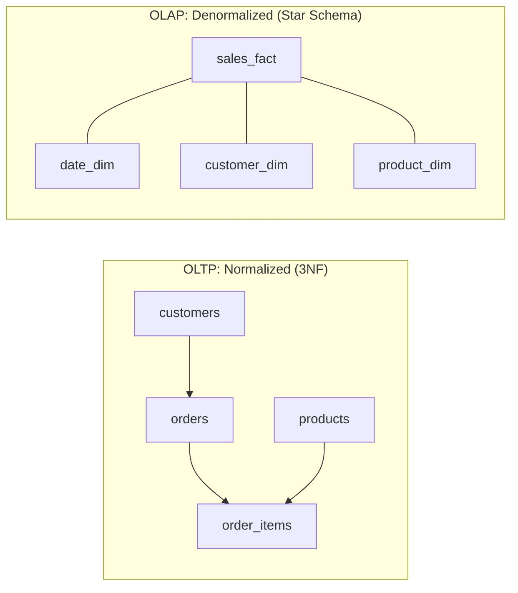

A useful mental model: OLTP schemas are optimized to make **writing correct** and cheap. OLAP schemas are optimized to make **reading and aggregating** fast, even if it means loading the same customer name into a dimension table millions of times.

---

## 7. Storage Structure: Row-Oriented vs Column-Oriented

This is the single architectural decision that drives almost every other difference between OLTP and OLAP engines.

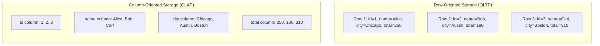

- **Row-oriented** engines write and fetch an entire row in one disk operation, ideal for "get/update everything about record X" (a single order, a single user profile).
- **Column-oriented** engines read only the specific columns a query needs, across many rows, and compress each column efficiently since values within a column tend to be similar (this is why `region` or `status` columns compress extremely well). This is ideal for "sum this one column across 50 million rows."

This is also why running a heavy analytical `GROUP BY` query directly on a production OLTP database is a common and costly mistake: the row-store engine has to read far more data than necessary and can compete with production traffic for locks and I/O.

---

## 8. When to Use Which

Use the decision guide below. In almost every real system, the honest answer is "you need both," just wired together correctly (see [Section 9](#9-how-they-work-together-in-the-real-world)).

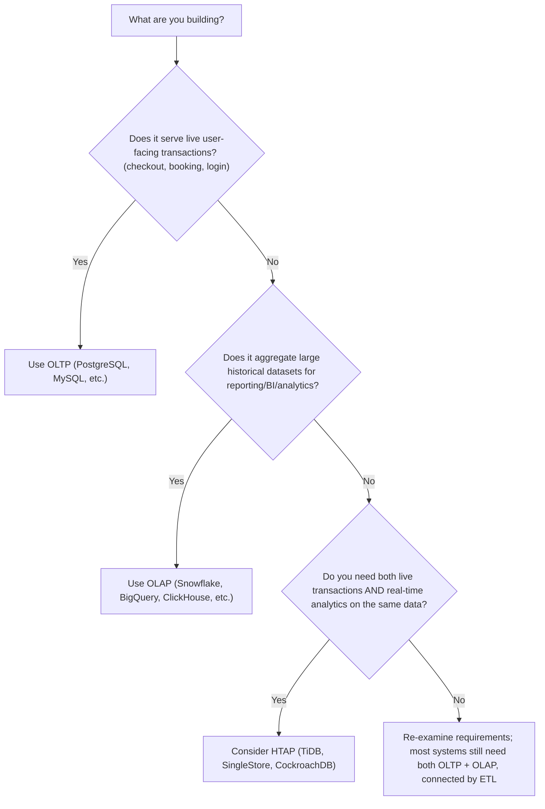

**Choose OLTP when:**
- You need sub-second (often sub-50ms) response times on single-row reads/writes
- Many concurrent users are creating, updating, or reading small amounts of data
- Correctness and consistency under concurrent writes matters more than query flexibility
- Example: checkout flow, inventory decrement, user authentication

**Choose OLAP when:**
- You need to run aggregations, trends, or joins across large historical datasets
- Query flexibility (ad-hoc slicing and dicing) matters more than millisecond latency
- Data can be slightly stale (minutes to hours old) without hurting the business use case
- Example: monthly revenue dashboard, churn analysis, executive reporting

---

## 9. How They Work Together in the Real World

Very few companies pick only one. A typical modern data architecture looks like this:

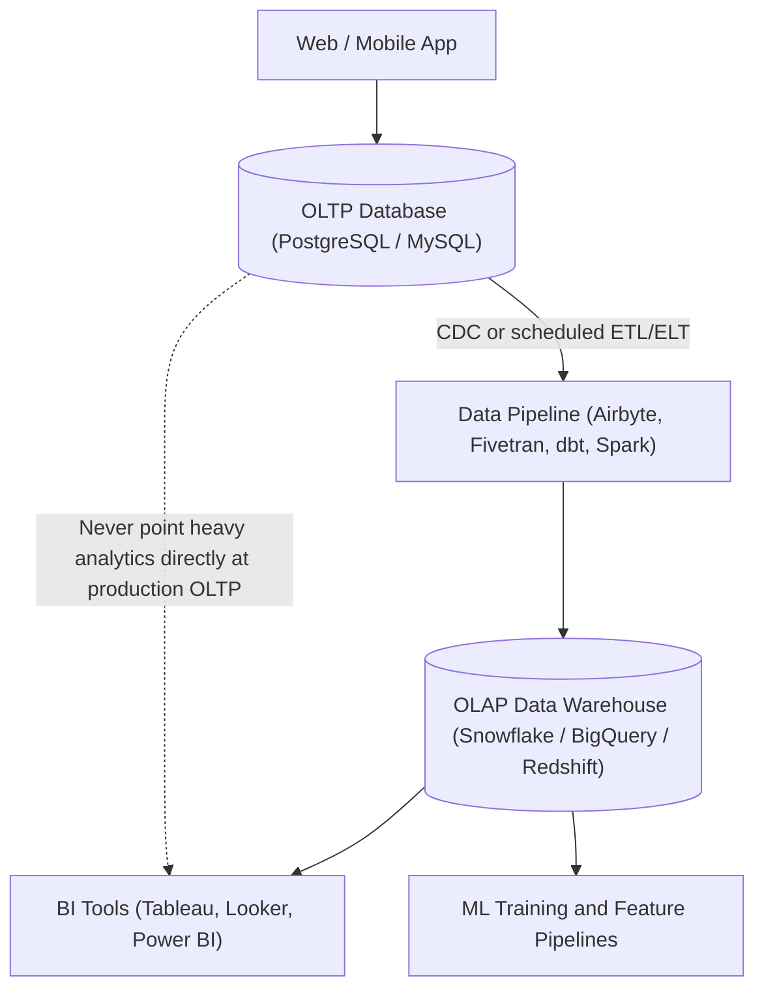

The transactional database (OLTP) stays lean, fast, and focused on serving the live application. A pipeline, often using **Change Data Capture (CDC)** for near-real-time sync or a scheduled batch job for periodic sync, copies and reshapes that data into the warehouse (OLAP), where it can be queried heavily without ever risking the performance or stability of the production application.

This is also why running analytics workloads directly against a production OLTP database is discouraged: a single expensive aggregate query can lock rows, saturate I/O, or starve the connection pool that the live application depends on.

---

## 10. Hybrid Approaches: HTAP

**HTAP (Hybrid Transactional/Analytical Processing)** is an emerging category of database that tries to close the gap between OLTP and OLAP by supporting both workloads on the same underlying data, without a separate ETL pipeline and without the resulting lag between "what happened" and "what the dashboard shows."

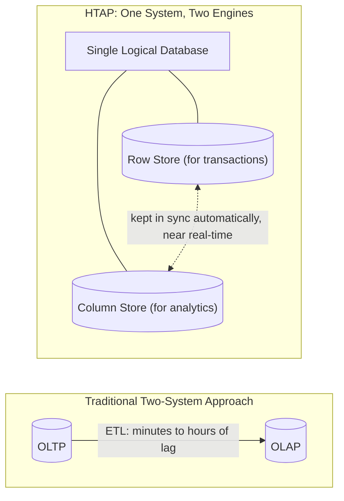

**How HTAP systems typically work under the hood:** rather than forcing one storage format to serve both patterns well (which is very difficult), most HTAP engines internally maintain *both* a row-oriented store (for fast transactional writes) and a column-oriented store (for fast analytical reads), and keep them synchronized automatically and quickly. The user interacts with what looks like one database.

**When HTAP makes sense:**
- Real-time dashboards that must reflect transactions from seconds ago (fraud detection, live operational monitoring, ride-sharing surge pricing)
- Teams that want to avoid the operational overhead of maintaining a separate ETL pipeline and two systems
- Workloads where "good enough" performance on both sides beats "best-in-class" performance on one side

**When HTAP is not the right choice:**
- Extremely high-scale, well-separated workloads where a dedicated OLTP engine and a dedicated OLAP engine, each fully optimized for its job, will outperform a general-purpose hybrid system
- Mature organizations that already have a stable, well-understood ETL/warehouse pipeline and no urgent need for real-time freshness

**Representative HTAP systems:** TiDB, SingleStore, CockroachDB (with analytical extensions), Google AlloyDB, and Snowflake's Unistore. Most of these use the "two storage engines under one roof" pattern described above. For example, TiDB pairs a row store called TiKV with a columnar store called TiFlash.

---

## 11. Quick Reference Cheat Sheet

| If someone says... | They probably mean... |
|---|---|
| "The database is slow when a customer checks out" | An OLTP problem: look at locks, indexes, connection pool |
| "The dashboard takes forever to load" | An OLAP problem: look at the warehouse query, aggregation strategy, or whether it is hitting the production OLTP database by mistake |
| "We need a single source of truth for reporting" | You need a data warehouse (OLAP), fed by ETL/ELT from your OLTP systems |
| "We want dashboards to update the second a transaction happens" | You may need CDC-based streaming ETL, or an HTAP system |
| "Should this table be normalized or denormalized?" | Normalize for OLTP (writes/consistency); denormalize for OLAP (reads/aggregation) |
| "Should we use a row store or column store?" | Row store for OLTP; column store for OLAP |

**One-sentence summary:** OLTP keeps the business running right now, one small transaction at a time; OLAP helps the business understand itself over time, one large aggregation at a time; and most real systems need both, connected by a pipeline, or increasingly, unified by an HTAP engine.

---

## 12. Further Reading

This guide was researched from and cross-checked against the following sources:

- [GeeksforGeeks: Difference Between OLAP and OLTP in DBMS](https://www.geeksforgeeks.org/dbms/difference-between-olap-and-oltp-in-dbms/)
- [IBM: OLAP vs OLTP](https://www.ibm.com/think/topics/olap-vs-oltp)
- [ClickHouse: OLTP vs OLAP](https://clickhouse.com/resources/engineering/oltp-vs-olap)
- [Stitch Data: OLTP vs OLAP](https://www.stitchdata.com/resources/oltp-vs-olap/)
- [Snowflake: OLAP vs OLTP, the Differences](https://www.snowflake.com/en/fundamentals/olap-vs-oltp-the-differences/)
- [Snowflake: What Is a Star Schema?](https://www.snowflake.com/en/fundamentals/star-schema/)
- [Kimball Group: Star Schema and OLAP Cube](https://www.kimballgroup.com/data-warehouse-business-intelligence-resources/kimball-techniques/dimensional-modeling-techniques/star-schema-olap-cube/)
- [PingCAP: Real-World HTAP, A Look at TiDB and SingleStore](https://www.pingcap.com/blog/real-world-htap-a-look-at-tidb-and-singlestore-and-their-architectures/)
- [SingleStore: Beginner's Guide to HTAP Databases](https://www.singlestore.com/blog/what-is-htap/)
- Video reference: [YouTube: OLTP vs OLAP explainer](https://www.youtube.com/watch?v=wdJejI0bZRQ)

All Mermaid diagrams in this document render natively on GitHub, GitLab, and most modern Markdown viewers (including VS Code with the Markdown Preview Mermaid extension). If your viewer does not render Mermaid, the diagrams still read clearly as structured text.
