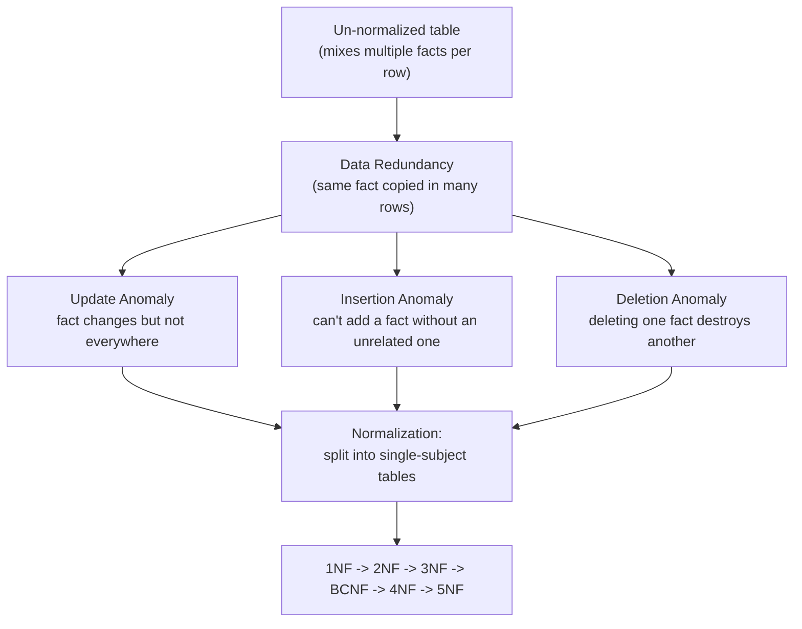
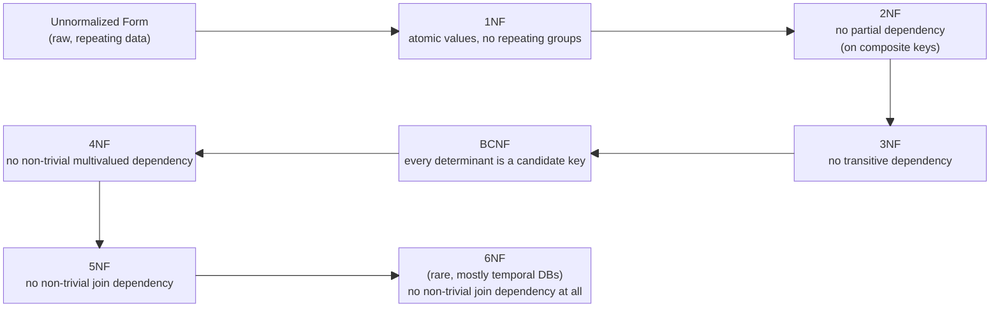

# Database Normalization

A complete, self-contained guide to database normalization: what it is, why it exists, and how to apply 1NF through 5NF (with notes on 6NF and denormalization) using worked examples.

## Table of Contents

1. [What Is Database Normalization?](#what-is-database-normalization)
2. [Why It Matters: Redundancy and Anomalies](#why-it-matters-redundancy-and-anomalies)
3. [Foundational Concepts: Keys and Functional Dependencies](#foundational-concepts-keys-and-functional-dependencies)
4. [The Normalization Ladder (Overview Diagram)](#the-normalization-ladder-overview-diagram)
5. [First Normal Form (1NF)](#first-normal-form-1nf)
6. [Second Normal Form (2NF)](#second-normal-form-2nf)
7. [Third Normal Form (3NF)](#third-normal-form-3nf)
8. [Boyce-Codd Normal Form (BCNF)](#boyce-codd-normal-form-bcnf)
9. [Fourth Normal Form (4NF)](#fourth-normal-form-4nf)
10. [Fifth Normal Form (5NF)](#fifth-normal-form-5nf)
11. [A Brief Note on Sixth Normal Form (6NF)](#a-brief-note-on-sixth-normal-form-6nf)
12. [Denormalization: The Deliberate Trade-off](#denormalization-the-deliberate-trade-off)
13. [Key Concepts and Terminology (Glossary)](#key-concepts-and-terminology-glossary)
14. [Comparisons: Normal Forms vs. Alternative Design Approaches](#comparisons-normal-forms-vs-alternative-design-approaches)
15. [Common Pitfalls and Misconceptions](#common-pitfalls-and-misconceptions)
16. [Best Practices](#best-practices)
17. [Summary Table: All Normal Forms at a Glance](#summary-table-all-normal-forms-at-a-glance)
18. [Further Learning Path](#further-learning-path)
19. [References](#references)

---

## What Is Database Normalization?

**Plain-language definition:** Normalization is the process of organizing the columns and tables of a relational database so that each piece of information is stored in exactly one place. Instead of one giant spreadsheet-like table that repeats the same facts over and over, you split the data into smaller, related tables, each focused on a single subject (a student, a course, an order, a product), and you connect them with keys.

**Precise, technical definition:** Database normalization is a systematic, multi-step process, formalized by Edgar F. Codd in the 1970s alongside the relational model itself, that transforms a relation (table) into a series of smaller relations that satisfy increasingly strict rules called **normal forms**. Each normal form is defined in terms of **functional dependencies** (rules describing how one column's value determines another's) and is designed to eliminate a specific category of **data redundancy** and the **update anomalies** that redundancy causes, without losing any information (this "no information loss" property is called a **lossless decomposition**).

Normalization is not a single action, it is a ladder. Each rung (1NF, 2NF, 3NF, BCNF, 4NF, 5NF) assumes the rungs below it have already been satisfied, and each rung fixes a problem that the previous rung could not.

> **Callout:** Normalization is about *structure*, not about performance directly. A normalized database is usually easier to keep correct and consistent. Whether it is also fast depends on your workload, indexing, and query patterns, more on this trade-off in the [Denormalization](#denormalization-the-deliberate-trade-off) section.

---

## Why It Matters: Redundancy and Anomalies

Before learning the mechanics of 1NF through 5NF, you need to understand the pain normalization is designed to relieve. Without it, you get **data redundancy**: the same fact stored in multiple rows. Redundancy is not just wasted disk space, it is a correctness trap, because now every copy of that fact has to stay in sync manually, and nothing in the database enforces that.

Redundancy produces three classic problems, known as **anomalies**:

### 1. Update Anomaly

If the same fact is duplicated across many rows, updating it means you must find and change every single copy. Miss one, and your database now contains contradictory information for the same real-world fact.

*Example:* A `StudentCourse` table stores `InstructorOffice` in every row for every student taking that instructor's course. If the instructor moves offices, you must update dozens of rows. If you update only some, the database now claims the instructor has two offices at once.

### 2. Insertion Anomaly

Sometimes you cannot add a new fact because it is bundled together with another fact that does not yet exist, or the table's structure forces you to invent placeholder data.

*Example:* If instructor and course data are combined into one table keyed by enrollment, you cannot record that a new instructor has joined the department until that instructor is actually assigned to teach a course, because there is no row to put them in without a course value.

### 3. Deletion Anomaly

Deleting one fact accidentally destroys another, unrelated fact that happened to be stored in the same row.

*Example:* If the only place an instructor's department is recorded is in rows describing course enrollments, then deleting the last remaining enrollment row for that course wipes out your only record of who teaches it or what department they belong to.

All three anomalies share a root cause: **a single table is being asked to represent more than one independent real-world concept at once.** Normalization's entire purpose is to identify those hidden, mixed-together concepts and give each one its own table.

---

## Foundational Concepts: Keys and Functional Dependencies

You cannot reason about normal forms without these building blocks. Skim this section once, then refer back as needed.

- **Attribute**: a column in a table (for example, `StudentID`, `CourseName`).
- **Tuple**: a row in a table, representing one instance of the entity the table models.
- **Superkey**: any set of attributes that uniquely identifies a row.
- **Candidate key**: a *minimal* superkey, meaning no attribute can be removed from it and still uniquely identify the row. A table can have multiple candidate keys.
- **Primary key**: the candidate key chosen (by the designer) to be the table's main identifier.
- **Prime attribute**: any attribute that is part of *some* candidate key.
- **Non-prime attribute**: any attribute that is not part of any candidate key.
- **Composite key**: a candidate or primary key made up of more than one attribute.
- **Functional dependency (FD)**: written `A -> B`, meaning "the value of A determines the value of B." For every row with the same value of A, B must have the same value too. This is the single most important idea in normalization theory; every normal form from 2NF onward is defined in terms of functional dependencies.
  - Example: `StudentID -> StudentName` (a student ID determines exactly one student name).
- **Full functional dependency**: `B` depends on the *entire* composite key `A`, not on just part of it.
- **Partial dependency**: a non-key attribute depends on only *part* of a composite primary key, not the whole key. This is what 2NF eliminates.
- **Transitive dependency**: `A -> B` and `B -> C`, therefore `A -> C`, but `C` depends on `A` only *through* `B`, not directly. This is what 3NF eliminates.
- **Multivalued dependency (MVD)**: written `A ->> B`, meaning that for a given value of A, there is a set of values of B, independent of any other attribute in the table. This is what 4NF eliminates.
- **Join dependency (JD)**: a generalization of MVD, describing a table that can be losslessly reconstructed only by joining three or more of its projections. This is what 5NF eliminates.

Keep this mental model: **1NF and 2NF and 3NF and BCNF are all built on ordinary functional dependencies. 4NF is built on multivalued dependencies. 5NF is built on join dependencies.** Each is a strictly more general (and rarer) kind of dependency, which is why violations of 4NF and 5NF are much less common in everyday schema design than violations of 2NF or 3NF.

---

## The Normalization Ladder (Overview Diagram)

Each arrow represents "assumes the previous form is already satisfied, and additionally requires..." This is a strict hierarchy: a table in 3NF is automatically also in 2NF and 1NF, but not necessarily in BCNF.

---

## First Normal Form (1NF)

### Definition

A table is in 1NF if:
1. Every column holds a single, atomic (indivisible) value, no lists, no comma-separated values, no nested tables.
2. Every row is unique (there is a primary key).
3. There are no repeating groups of columns (like `Phone1`, `Phone2`, `Phone3`).

### The Problem It Solves

Multi-valued or repeating columns make querying, filtering, and updating painfully inconsistent. You cannot easily search "find every student who takes Physics" if `Physics` might be buried inside a comma-separated string in one column. Storing repeating groups as separate numbered columns (`Course1`, `Course2`) hard-codes a maximum and wastes space for anyone with fewer values, while providing no way to store more.

### Example: Before (Violates 1NF)

| StudentID | StudentName | Courses               |
|-----------|-------------|------------------------|
| 1         | Ayesha      | Physics, Chemistry     |
| 2         | Rohan       | Math                   |
| 3         | Wei         | Biology, Math, Physics |

The `Courses` column holds multiple atomic values. You cannot efficiently query "which students take Math" with standard SQL predicates (`WHERE Courses = 'Math'` would miss Wei's row entirely), and adding or removing one course requires rewriting the whole string.

### Example: After (Satisfies 1NF)

**Students**

| StudentID | StudentName |
|-----------|-------------|
| 1         | Ayesha      |
| 2         | Rohan       |
| 3         | Wei         |

**StudentCourses**

| StudentID | Course     |
|-----------|------------|
| 1         | Physics    |
| 1         | Chemistry  |
| 2         | Math       |
| 3         | Biology    |
| 3         | Math       |
| 3         | Physics    |

Now every value is atomic, every row is unique, and the number of courses a student takes is unbounded and query-friendly. The composite key of `StudentCourses` is `(StudentID, Course)`.

### Functional Dependency Reasoning

1NF is a structural rule rather than a dependency rule per se, but it is the prerequisite for functional dependencies to even make sense: you cannot say "A determines B" if B is not a single value in the first place. Every subsequent normal form assumes 1NF has already been satisfied.

---

## Second Normal Form (2NF)

### Definition

A table is in 2NF if:
1. It is already in 1NF, **and**
2. Every non-prime attribute is **fully functionally dependent** on the *entire* primary key (no partial dependency on just part of a composite key).

2NF only becomes a meaningful concern when the primary key is composite (made of two or more columns). If the primary key is a single column, any table in 1NF is automatically in 2NF.

### The Problem It Solves

**Partial dependency** causes redundancy when part of a composite key alone determines a non-key attribute. That attribute then gets repeated for every combination involving that partial key, creating update and deletion anomalies, exactly the kind described in the [anomalies section](#why-it-matters-redundancy-and-anomalies).

### Example: Before (Violates 2NF)

Suppose the primary key is the composite `(StudentID, CourseID)`.

| StudentID | CourseID | StudentName | CourseName | Grade |
|-----------|----------|-------------|------------|-------|
| 1         | C10      | Ayesha      | Physics    | A     |
| 1         | C20      | Ayesha      | Chemistry  | B     |
| 2         | C10      | Rohan       | Physics    | A-    |

Functional dependencies present:
- `StudentID -> StudentName` (partial dependency: only part of the key, `StudentID`, determines `StudentName`)
- `CourseID -> CourseName` (partial dependency: only part of the key, `CourseID`, determines `CourseName`)
- `(StudentID, CourseID) -> Grade` (full dependency: you need both parts of the key to know the grade)

`StudentName` and `CourseName` are stored redundantly for every enrollment row. Updating Ayesha's name requires updating every one of her enrollment rows. Deleting Ayesha's only enrollment row deletes the fact that "Ayesha" exists as a student at all.

### Example: After (Satisfies 2NF)

**Students**

| StudentID | StudentName |
|-----------|-------------|
| 1         | Ayesha      |
| 2         | Rohan       |

**Courses**

| CourseID | CourseName |
|----------|------------|
| C10      | Physics    |
| C20      | Chemistry  |

**Enrollments**

| StudentID | CourseID | Grade |
|-----------|----------|-------|
| 1         | C10      | A     |
| 1         | C20      | B     |
| 2         | C10      | A-    |

Now `StudentName` lives in exactly one row per student, `CourseName` lives in exactly one row per course, and `Grade`, which genuinely depends on the *combination* of student and course, stays in the junction table.

### Functional Dependency Reasoning

2NF's rule is precisely: eliminate any FD of the form `PartOfCompositeKey -> NonKeyAttribute`. The fix is always the same pattern: move the attribute that depends on only part of the key into its own table, keyed by that part.

---

## Third Normal Form (3NF)

### Definition

A table is in 3NF if:
1. It is already in 2NF, **and**
2. There is no **transitive dependency**: no non-prime attribute depends on another non-prime attribute. Formally, for every FD `A -> B`, either `A` is a candidate key (or superkey), or `B` is a prime attribute.

A simpler, commonly quoted phrasing (sometimes attributed loosely to Codd's original writing): *"Every non-key attribute must depend on the key, the whole key, and nothing but the key."*

### The Problem It Solves

Transitive dependency happens when a non-key column determines another non-key column. That means a fact is being stored based on something other than the table's actual identity, so again it gets duplicated whenever the "in-between" value repeats.

### Example: Before (Violates 3NF, but satisfies 2NF)

Primary key: `EmployeeID` (a single column, so this table trivially satisfies 2NF already).

| EmployeeID | EmployeeName | DepartmentID | DepartmentName | DepartmentLocation |
|------------|--------------|--------------|-----------------|---------------------|
| 101        | Maria        | D1           | Engineering     | Chicago             |
| 102        | Sam          | D1           | Engineering     | Chicago             |
| 103        | Priya        | D2           | Sales           | Austin              |

Functional dependencies present:
- `EmployeeID -> EmployeeName, DepartmentID` (fine, this is the key doing its job)
- `DepartmentID -> DepartmentName, DepartmentLocation` (transitive: `EmployeeID -> DepartmentID -> DepartmentName`, so `EmployeeName` and `DepartmentName` do not depend directly on the key, they depend on it *through* `DepartmentID`)

`DepartmentName` and `DepartmentLocation` are repeated for every employee in that department. If Engineering relocates from Chicago to a new office, you must update every one of Maria's and Sam's rows. Miss one, and you have an update anomaly: the same department appears to be in two places.

### Example: After (Satisfies 3NF)

**Employees**

| EmployeeID | EmployeeName | DepartmentID |
|------------|--------------|--------------|
| 101        | Maria        | D1           |
| 102        | Sam          | D1           |
| 103        | Priya        | D2           |

**Departments**

| DepartmentID | DepartmentName | DepartmentLocation |
|--------------|-----------------|---------------------|
| D1           | Engineering     | Chicago             |
| D2           | Sales           | Austin              |

Now department facts live in exactly one row per department, and `Employees.DepartmentID` simply references it.

### Functional Dependency Reasoning

3NF's rule targets FDs of the shape `NonKey1 -> NonKey2`. The fix pulls `NonKey1` and everything it determines out into its own table, keyed by `NonKey1`, and leaves a foreign key reference behind.

> **2NF vs. 3NF, side by side:** 2NF removes dependencies on *part* of a composite key. 3NF removes dependencies that skip the key entirely and instead chain through another non-key column. They solve the same category of problem (redundancy from an attribute not depending directly and fully on the key) but at two different structural points.

---

## Boyce-Codd Normal Form (BCNF)

### Definition

A table is in BCNF (sometimes called 3.5NF) if, for every non-trivial functional dependency `A -> B`, `A` is a **superkey** (it must be able to determine every other attribute in the table on its own).

BCNF is a stricter version of 3NF. 3NF has a loophole: it allows `A -> B` even when `A` is not a superkey, as long as `B` happens to be a prime attribute (part of some candidate key). BCNF closes that loophole entirely.

### The Problem It Solves

3NF can still permit redundancy in the specific case where a table has **multiple overlapping candidate keys**, and a non-superkey determinant happens to determine a prime attribute. BCNF removes this last class of anomaly caused by overlapping candidate keys.

### Example: Before (Satisfies 3NF, but Violates BCNF)

A university has a rule: each course is taught by exactly one instructor, but a given instructor might teach several courses, and a student can take a course from any qualified instructor, but for that course, only one instructor is actually assigned.

| StudentID | CourseID | Instructor |
|-----------|----------|------------|
| 1         | Physics  | Dr. Lee    |
| 2         | Physics  | Dr. Lee    |
| 1         | Math     | Dr. Rao    |
| 3         | Math     | Dr. Rao    |

Candidate keys: `(StudentID, CourseID)` is a candidate key (a student cannot enroll twice in the same course). But there is also this FD:
- `CourseID -> Instructor` (each course has exactly one instructor)

Is this a 3NF violation? Check: `CourseID` is not a superkey by itself. But `Instructor` is not a prime attribute here either (it is not part of any candidate key), so this actually *also* violates 3NF, not just BCNF. Let's use the textbook BCNF example instead, one where the violating attribute genuinely is prime.

**Corrected classic example:** Suppose a student can take a course from more than one qualified instructor for that course (multiple instructors teach the same course to different students), but each instructor teaches only one course.

| StudentID | CourseID | Instructor |
|-----------|----------|------------|
| 1         | Physics  | Dr. Lee    |
| 2         | Physics  | Dr. Amara  |
| 3         | Math     | Dr. Rao    |
| 4         | Math     | Dr. Rao    |

Here, candidate keys are `(StudentID, CourseID)` and `(StudentID, Instructor)` (both uniquely identify a row, since a student takes one course from one instructor, and we assume a student never repeats a course). The FD:
- `Instructor -> CourseID` (each instructor teaches only one course)

`Instructor` is not a superkey (it doesn't determine `StudentID`), yet it determines `CourseID`, which *is* a prime attribute (part of the second candidate key). This satisfies 3NF's loophole but violates BCNF, because the determinant `Instructor` is not a superkey. The result: `Dr. Rao -> Math` is repeated in every row where Dr. Rao appears, and if Dr. Rao switches to teaching Chemistry, you must update every row referencing him, an update anomaly.

### Example: After (Satisfies BCNF)

**InstructorCourse**

| Instructor | CourseID |
|------------|----------|
| Dr. Lee    | Physics  |
| Dr. Amara  | Physics  |
| Dr. Rao    | Math     |

**Enrollments**

| StudentID | Instructor |
|-----------|------------|
| 1         | Dr. Lee    |
| 2         | Dr. Amara  |
| 3         | Dr. Rao    |
| 4         | Dr. Rao    |

Now `Instructor -> CourseID` lives in exactly one row per instructor.

### Functional Dependency Reasoning

BCNF's test is simple to apply mechanically: list every non-trivial FD in the table. For each one, `A -> B`, ask "is A a superkey?" If the answer is ever no, the table violates BCNF, regardless of whether B happens to be part of a candidate key.

> **Trade-off to know:** Every BCNF decomposition is guaranteed to be lossless (no data is lost when you split the table and rejoin it). However, it is not always guaranteed to be **dependency-preserving** (some FDs might only be checkable by joining tables back together, which can make enforcing certain constraints harder at the database level). 3NF, by contrast, always guarantees both losslessness and dependency preservation. This is the classic trade-off between 3NF and BCNF: BCNF is theoretically "cleaner" but occasionally less convenient to enforce.

---

## Fourth Normal Form (4NF)

### Definition

A table is in 4NF if:
1. It is already in BCNF, **and**
2. It has no **non-trivial multivalued dependency (MVD)** other than one implied by a candidate key. Formally, for every MVD `A ->> B`, `A` is a superkey.

### The Problem It Solves

A multivalued dependency occurs when one attribute determines a *set* of values for another attribute, and that set is completely independent of a third attribute in the same table. When two independent multivalued facts about the same entity are crammed into one table, you are forced to store every combination of the two, creating redundancy that has nothing to do with ordinary functional dependency (this is why 4NF sits above BCNF: a table can satisfy BCNF perfectly while still having this problem).

### Example: Before (Violates 4NF)

A course can be taught by multiple qualified instructors, and separately, a course can require multiple textbooks. Instructors and textbooks are entirely independent of each other, neither determines the other.

| CourseID | Instructor  | Textbook            |
|----------|-------------|----------------------|
| Physics  | Dr. Lee     | Halliday & Resnick   |
| Physics  | Dr. Lee     | University Physics   |
| Physics  | Dr. Amara   | Halliday & Resnick   |
| Physics  | Dr. Amara   | University Physics   |

Because `Instructor` and `Textbook` are independent multivalued facts about `CourseID`, the table is forced into a **cross-product**: every instructor must be paired with every textbook, even though no such pairing carries any real meaning. Add a third textbook, and you must add a new row for every existing instructor, or the data looks incomplete. This is redundancy with no functional dependency to blame, it comes from the multivalued dependencies:
- `CourseID ->> Instructor`
- `CourseID ->> Textbook`

### Example: After (Satisfies 4NF)

**CourseInstructors**

| CourseID | Instructor |
|----------|------------|
| Physics  | Dr. Lee    |
| Physics  | Dr. Amara  |

**CourseTextbooks**

| CourseID | Textbook            |
|----------|----------------------|
| Physics  | Halliday & Resnick   |
| Physics  | University Physics   |

Now adding a third textbook is a single insert into `CourseTextbooks`, with no forced pairing with instructors.

### Functional Dependency Reasoning

4NF generalizes the same intuition as 2NF and 3NF (isolate independent facts into their own tables) but for multivalued facts instead of single-valued ones. The rule of thumb: **if you ever find yourself needing a composite key of three or more columns just to represent "all combinations," check whether two of those columns are actually independent of each other.** If they are, split them into two separate two-column tables.

---

## Fifth Normal Form (5NF)

### Definition

A table is in 5NF (also called **Projection-Join Normal Form**, PJ/NF) if:
1. It is already in 4NF, **and**
2. It cannot be losslessly decomposed into any smaller set of tables (via **join dependency**) except in ways implied by its candidate keys. In other words, the table cannot be split into three or more smaller tables that, when joined back together (a "three-way" or "n-way" join), reconstruct the original data without introducing spurious rows.

### The Problem It Solves

5NF addresses cases where three (or more) facts are pairwise related in a specific, constrained way, and storing them together (or even splitting into just two tables) creates redundancy, but naively splitting into all pairs can also lose the constraint or introduce **spurious tuples** (fake row combinations that were never true) when the pairs are rejoined. 5NF is the point at which a table has been split as far as it can go while still using ordinary joins to reconstruct it exactly, no more, no less.

### Example: Before (Violates 5NF)

Consider agents who represent companies, but only for specific products, and the rule is: "Agent A represents Company C for Product P" if and only if A sells P, C makes P, and A represents C for at least one product (a real constraint of this specific business, not an arbitrary one).

| Agent  | Company   | Product     |
|--------|-----------|-------------|
| Anita  | AcmeCo    | Widgets     |
| Anita  | AcmeCo    | Gadgets     |
| Anita  | ZetaCorp  | Widgets     |
| Baris  | AcmeCo    | Widgets     |

This is a genuine three-way relationship (a **join dependency**) among `Agent`, `Company`, and `Product`. Splitting it into fewer than three tables loses information or introduces incorrect combinations. For example, splitting into just `(Agent, Company)` and `(Agent, Product)` and then joining them back would incorrectly suggest that Baris represents AcmeCo for Gadgets (because Anita does, and Baris sells Widgets), which is false, that is a **spurious tuple**.

### Example: After (Satisfies 5NF)

**AgentCompany**

| Agent  | Company   |
|--------|-----------|
| Anita  | AcmeCo    |
| Anita  | ZetaCorp  |
| Baris  | AcmeCo    |

**AgentProduct**

| Agent  | Product   |
|--------|-----------|
| Anita  | Widgets   |
| Anita  | Gadgets   |
| Baris  | Widgets   |

**CompanyProduct**

| Company   | Product   |
|-----------|-----------|
| AcmeCo    | Widgets   |
| AcmeCo    | Gadgets   |
| ZetaCorp  | Widgets   |

In this particular case, the true three-way relationship happens to require exactly this three-way join to reconstruct correctly (this is the textbook "agents, companies, products" example, and it only works cleanly when the underlying business rule truly is a decomposable join dependency; if the constraint cannot be recovered by joining pairs, the original three-column table must be kept as-is, because it is already in 5NF).

> **Important nuance:** Not every three-column table should be split into three two-column tables. 5NF only requires decomposition when the join dependency is real and the decomposition is lossless and reconstructs the original data exactly. If splitting would allow spurious rows to be reconstructed, the wider table was already the correct (5NF) design and should be left alone. This is why 5NF violations are rare in practice: most three-way relationships are not decomposable this way, they are genuine ternary facts that must remain a single table.

### Functional Dependency Reasoning

5NF is defined over **join dependencies**, a generalization of multivalued dependencies. A join dependency `JD(R1, R2, ..., Rn)` holds on table T if T is always exactly equal to the join of its projections R1 through Rn. 5NF requires that every such non-trivial join dependency be implied by the candidate keys, meaning any decomposition beyond what the keys already dictate would either lose information or be unnecessary.

---

## A Brief Note on Sixth Normal Form (6NF)

6NF is rarely relevant outside of specialized systems, but is worth knowing about. A table is in 6NF if it contains no non-trivial join dependency at all, meaning it cannot be split any further without losing meaning, even along the lines that 5NF still allows. In practice, 6NF is used almost exclusively in **temporal databases**, where each fact (for example, "Supplier X was located in Chicago from January to June") is stored in its own narrow table with explicit validity time ranges, so that individual attributes can change independently over time without forcing a wide row to be rewritten just because one field changed. Most application databases never need 6NF, it is a specialist tool for systems that must track detailed historical validity of every attribute independently.

---

## Denormalization: The Deliberate Trade-off

Normalization optimizes for **data integrity** (correctness, no redundancy, no anomalies). It does this by increasing the number of tables, which usually means more `JOIN` operations to answer a query. For read-heavy systems, especially analytics, reporting, and dashboards, that many joins can become a real performance cost.

**Denormalization** is the deliberate, informed act of reintroducing some redundancy (for example, storing a `CustomerName` directly on an `Orders` table instead of always joining to `Customers`) to reduce the number of joins needed for common queries. It is not a mistake or a failure to normalize properly, it is a targeted, documented trade-off, usually applied after a schema has already been normalized and specific performance bottlenecks have been measured.

| Aspect | Normalized Design | Denormalized Design |
|---|---|---|
| Data redundancy | Minimal | Deliberately increased |
| Write/update complexity | Simple (one place to change a fact) | Complex (must keep copies in sync) |
| Read/query complexity | More joins needed | Fewer joins, often faster reads |
| Risk of anomalies | Low | Higher, must be managed with triggers, application logic, or batch jobs |
| Typical use case | Transactional (OLTP) systems | Analytical (OLAP), reporting, caching layers, read replicas |

Common denormalization techniques include: duplicating a frequently joined column, precomputing and storing aggregate values (like an order total), and using materialized views. Whichever technique you choose, document *why* the redundancy exists and *how* it is kept consistent, otherwise the next engineer will assume it is a bug.

---

## Key Concepts and Terminology (Glossary)

| Term | Meaning |
|---|---|
| Attribute | A column in a table |
| Tuple | A row in a table |
| Relation | The formal term for a table |
| Domain | The set of allowable values for an attribute |
| Candidate key | A minimal set of attributes that uniquely identifies a row |
| Primary key | The chosen candidate key used as the main identifier |
| Prime attribute | An attribute that belongs to at least one candidate key |
| Composite key | A key made of more than one attribute |
| Foreign key | An attribute (or set of attributes) referencing a primary key in another table |
| Functional dependency (FD) | A rule where the value of one attribute determines another (`A -> B`) |
| Partial dependency | A non-key attribute depends on only part of a composite key |
| Transitive dependency | A non-key attribute depends on another non-key attribute rather than the key |
| Multivalued dependency (MVD) | An attribute determines a set of values of another attribute, independent of other columns |
| Join dependency (JD) | A generalization of MVD describing when a table must be reconstructed by joining three or more projections |
| Lossless decomposition | Splitting a table into smaller tables such that joining them back reproduces the original data exactly |
| Dependency preservation | A decomposition where all original functional dependencies can still be checked without needing to join tables |
| Spurious tuple | A row that appears after a join but was never actually true in the original data, a sign of a bad or unnecessary decomposition |
| Update anomaly | Inconsistency caused by updating only some copies of a duplicated fact |
| Insertion anomaly | Inability to record a fact because unrelated required data is missing |
| Deletion anomaly | Loss of an unrelated fact as a side effect of deleting a row |
| Denormalization | Deliberately reintroducing redundancy to improve read performance |

---

## Comparisons: Normal Forms vs. Alternative Design Approaches

Normalization is not the only philosophy for structuring data. It is worth knowing how it compares to other common approaches, especially since modern systems often mix them.

| Approach | Core Idea | Strength | Weakness | Typical Use |
|---|---|---|---|---|
| Normalization (1NF-5NF) | Split data by dependency rules to eliminate redundancy | Strong data integrity, no update anomalies | More joins, can be slower for reads | Transactional systems (OLTP): banking, order systems, CRMs |
| Denormalization | Reintroduce redundancy deliberately for speed | Fewer joins, faster reads | Risk of inconsistency if not carefully managed | Reporting, analytics, caching layers |
| Star schema (data warehousing) | One central fact table surrounded by denormalized dimension tables | Simple, fast for aggregation queries | Redundant dimension data, not update-friendly | OLAP, business intelligence dashboards |
| Document/NoSQL modeling | Embed related data directly inside a document (denormalized by default) | Fast reads for whole-object retrieval, flexible schema | Duplication across documents, harder multi-record consistency | Content management, catalogs, flexible/evolving schemas |
| Entity-Attribute-Value (EAV) | Store attributes as rows instead of columns for maximum flexibility | Extremely flexible schema, no migrations for new attributes | Hard to query, poor performance, weak type safety | Highly variable attributes (medical records, product catalogs with wildly different specs) |

Normalization theory underlies relational (SQL) database design specifically. NoSQL and document databases often intentionally favor denormalized, embedded structures because they are optimized for different access patterns (retrieve one whole document quickly, rather than join many small tables).

---

## Common Pitfalls and Misconceptions

1. **"Normalization always makes a database faster."** False. Normalization optimizes for integrity and reduces redundancy. It typically *increases* the number of joins needed to answer a query, which can slow down reads. Performance is a separate concern addressed with indexing, caching, and sometimes denormalization.

2. **"You must always normalize all the way to 5NF."** Not necessarily. Most production systems stop at 3NF or BCNF because 4NF and 5NF violations are rare in practice, and over-normalizing tables that do not actually have multivalued or join dependencies adds unnecessary complexity for no real benefit.

3. **"A composite primary key automatically means the table violates 2NF."** False. 2NF is only violated if a non-key attribute depends on *part* of the composite key. A composite key by itself is fine.

4. **"3NF and BCNF are the same thing."** Close, but not identical. BCNF is strictly stricter. A table can satisfy 3NF while still violating BCNF if it has overlapping candidate keys with a specific dependency pattern (see the BCNF section above).

5. **"Normalization eliminates all redundancy."** Normalization eliminates redundancy caused by *functional, multivalued, and join dependencies*. It does not eliminate every kind of duplication (for example, intentional caching, replicated read copies, or backup copies are a different category entirely).

6. **"1NF just means no duplicate rows."** 1NF is about atomic values and no repeating groups, not primarily about duplicate rows (though a valid primary key does prevent fully duplicate rows).

7. **"Foreign keys automatically make a schema normalized."** Having foreign keys is a mechanism for connecting normalized tables, but simply having relationships between tables does not guarantee any particular normal form has been achieved. You still need to check the dependencies.

---

## Best Practices

1. **Model entities first, normalize second.** Identify the real-world "nouns" in your system (customer, order, product, instructor) before worrying about normal forms. Good entity modeling naturally produces most of 2NF and 3NF.
2. **Normalize to at least 3NF for transactional (OLTP) systems by default.** This is the sweet spot for most application databases: it eliminates the vast majority of anomalies while keeping the schema understandable.
3. **Check BCNF specifically when a table has more than one candidate key.** That is the exact situation where 3NF's loophole can hide a redundancy.
4. **Watch for accidental multivalued dependencies when a composite key has three or more columns.** If two of those columns are truly independent of each other, you likely need 4NF-style decomposition.
5. **Do not force a 5NF decomposition onto a genuine ternary (three-way) relationship.** Only decompose if the join dependency is real and lossless; otherwise, keep the three-column table intact.
6. **Denormalize deliberately, not accidentally.** If you reintroduce redundancy for performance, document it, and put a mechanism in place (triggers, application logic, scheduled jobs, or materialized views) to keep the copies consistent.
7. **Use constraints to enforce what normalization implies.** Primary keys, foreign keys, unique constraints, and `NOT NULL` should mirror the functional dependencies your schema is built around; normalization tells you what the rules should be, but the database enforces them.
8. **Revisit normalization when requirements change.** A table that was correctly in 3NF can drift out of normal form if new business rules introduce new dependencies (for example, a new rule making one attribute determine another that used to be independent).

---

## Summary Table: All Normal Forms at a Glance

| Normal Form | Requires (in addition to previous form) | Anomaly / Problem It Fixes | Type of Dependency Involved |
|---|---|---|---|
| **1NF** | Atomic column values, unique rows, no repeating groups | Ambiguous, non-queryable multi-valued columns | N/A (structural) |
| **2NF** | No partial dependency: every non-key attribute depends on the *whole* (composite) primary key | Redundancy from attributes that depend on only part of a composite key | Functional dependency |
| **3NF** | No transitive dependency: non-key attributes depend only on the key, not on other non-key attributes | Redundancy from attributes chained through another non-key attribute | Functional dependency |
| **BCNF** | Every determinant of any non-trivial FD must be a superkey | Redundancy from overlapping candidate keys that 3NF's exception allows to slip through | Functional dependency |
| **4NF** | No non-trivial multivalued dependency unless the determinant is a superkey | Redundant "cross-product" rows from two independent multivalued facts in one table | Multivalued dependency |
| **5NF** | No non-trivial join dependency unless implied by candidate keys | Redundancy or spurious rows from a genuine three-way (or n-way) relationship that can be losslessly split further | Join dependency |
| **6NF** (rare) | No non-trivial join dependency at all | Attributes cannot evolve independently over time (mainly a temporal database concern) | Join dependency |

---

## Further Learning Path

If you want to deepen your understanding beyond this document, this is a sensible order:

1. **Practice identifying functional dependencies by hand.** Take any messy spreadsheet you have (an expense log, a contact list) and write out every FD you can find before trying to normalize it. This builds the core skill every normal form depends on.
2. **Study relational algebra basics** (selection, projection, join, union). Understanding how `JOIN` actually reconstructs decomposed tables makes "lossless decomposition" click intuitively rather than abstractly.
3. **Learn to read and write SQL `CREATE TABLE` statements with constraints** (`PRIMARY KEY`, `FOREIGN KEY`, `UNIQUE`, `NOT NULL`, `CHECK`). Translating normal forms into actual schema definitions solidifies the theory.
4. **Study Entity-Relationship (ER) modeling and ER diagrams.** ER modeling is typically done *before* normalization and often produces a schema that is already close to 3NF; understanding both together shows how they complement each other.
5. **Explore denormalization and data warehousing concepts** (star schema, snowflake schema, OLAP vs. OLTP). This shows you the deliberate trade-offs made once you understand what normalization protects.
6. **Read Codd's original relational model papers or a formal database theory textbook** (for example, "Database System Concepts" by Silberschatz, Korth, and Sudarshan, or "An Introduction to Database Systems" by C.J. Date) for the rigorous mathematical treatment of functional, multivalued, and join dependencies.
7. **Practice on real schemas.** Take an open-source application's database schema and evaluate which normal form each table is in, and whether any denormalization was deliberately applied and why.

---

## References

### User-provided resources (seed material)

- [Introduction to Database Normalization (video)](https://www.youtube.com/watch?v=GFQaEYEc8_8)
- [Introduction of Database Normalization, GeeksforGeeks](https://www.geeksforgeeks.org/dbms/introduction-of-database-normalization/)
- [Database Normalization: 1NF, 2NF, 3NF, and BCNF Examples, DigitalOcean](https://www.digitalocean.com/community/tutorials/database-normalization)
- [What Is Database Normalization?, Google Cloud](https://cloud.google.com/discover/what-is-database-normalization?hl=en)

### Additional research (used to verify accuracy and fill gaps on 4NF, 5NF, and 6NF)

- [4th and 5th Normal Form in DBMS, GeeksforGeeks](https://www.geeksforgeeks.org/dbms/introduction-of-4th-and-5th-normal-form-in-dbms/)
- [Fifth Normal Form, Wikipedia](https://en.wikipedia.org/wiki/Fifth_normal_form)
- [Difference Between 4NF and 5NF, TutorialsPoint](https://www.tutorialspoint.com/dbms/difference_between_4nf_and_5nf.htm)
- [Join Dependencies and Fifth Normal Form, Brainkart](https://www.brainkart.com/article/Join-Dependencies-and-Fifth-Normal-Form_11501/)
- [Examples of Join Dependency in DBMS, BYJU'S GATE Notes](https://byjus.com/gate/join-dependency-in-dbms-notes/)
- [Fourth Normal Form, ScienceDirect Topics](https://www.sciencedirect.com/topics/computer-science/fourth-normal-form)
- [Sixth Normal Form, Wikipedia](https://en.wikipedia.org/wiki/Sixth_normal_form)
- [Sixth Normal Form, HandWiki](https://handwiki.org/wiki/Sixth_normal_form)
- [Relational Model of Temporal Data Based on 6th Normal Form, ResearchGate](https://www.researchgate.net/publication/321127890_Relational_model_of_temporal_data_based_on_6th_normal_form)
- [Multivalued dependencies and a new normal form for relational databases, ACM Transactions on Database Systems](https://dl.acm.org/doi/10.1145/320557.320571)