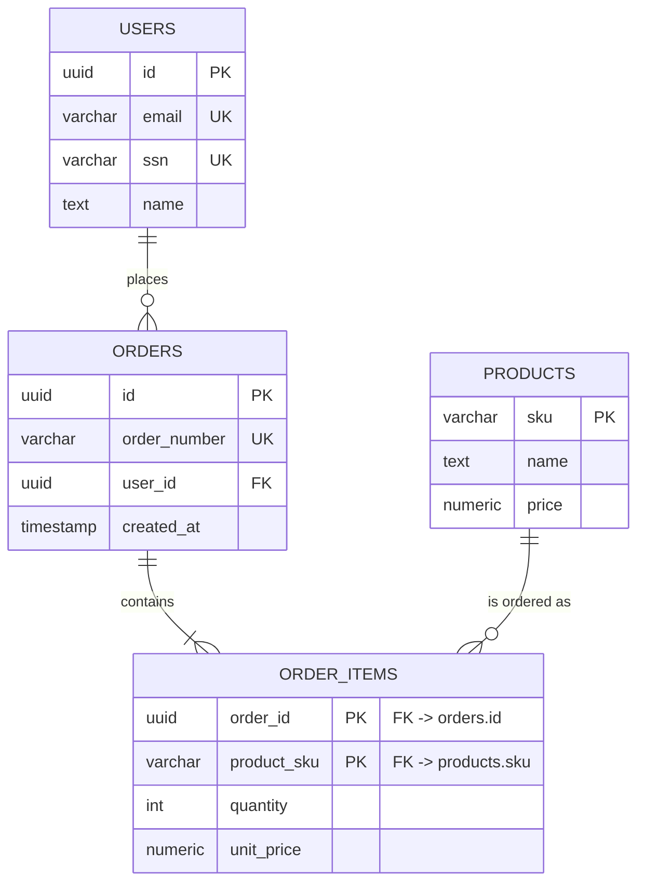
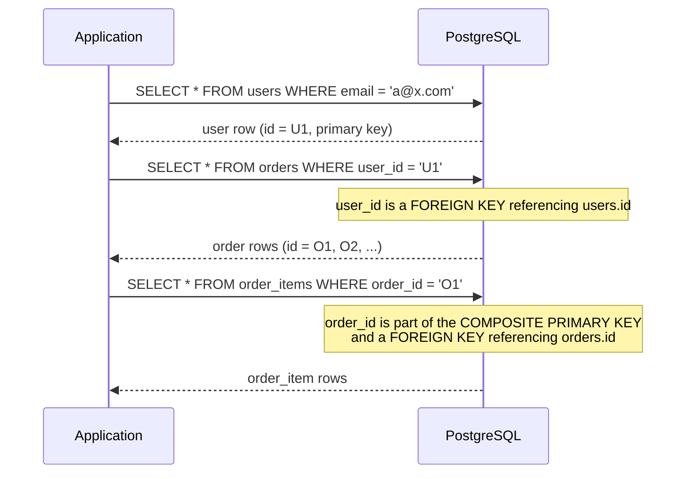

# Database Keys: Primary, Foreign, Candidate, Surrogate, and Many More

A complete, self-contained guide to every type of key you will encounter in relational database design, why each one exists, how they relate to each other, and how to implement them correctly in a modern PostgreSQL and Drizzle ORM stack.

## Table of Contents

1. [What Is a Database Key?](#what-is-a-database-key)
2. [Why Keys Matter](#why-keys-matter)
3. [The Example Schema Used Throughout This Guide](#the-example-schema-used-throughout-this-guide)
4. [Super Key](#super-key)
5. [Candidate Key](#candidate-key)
6. [Primary Key](#primary-key)
7. [Alternate Key (Secondary Key)](#alternate-key-secondary-key)
8. [Unique Key vs Primary Key](#unique-key-vs-primary-key)
9. [Composite Key vs Compound Key](#composite-key-vs-compound-key)
10. [Foreign Key](#foreign-key)
11. [Surrogate Key vs Natural Key](#surrogate-key-vs-natural-key)
12. [Other Keys You Should Know](#other-keys-you-should-know)
13. [Full Glossary Table](#full-glossary-table)
14. [Entity Relationship Diagrams](#entity-relationship-diagrams)
15. [Decision Tree: Which Key Should I Use?](#decision-tree-which-key-should-i-use)
16. [Keys in PostgreSQL and Drizzle ORM](#keys-in-postgresql-and-drizzle-orm)
17. [Referential Integrity](#referential-integrity)
18. [Indexing Implications](#indexing-implications)
19. [Comparisons at a Glance](#comparisons-at-a-glance)
20. [Common Pitfalls and Misconceptions](#common-pitfalls-and-misconceptions)
21. [Best Practices](#best-practices)
22. [Further Learning Path](#further-learning-path)
23. [References](#references)

---

## What Is a Database Key?

**Plain-language definition:** A key is one or more columns in a database table that you use to find a specific row, or to connect rows in one table to rows in another table. Think of it like a house address, an ID card number, or a barcode on a product. It is a label that lets you point at exactly one thing without confusion.

**Precise, technical definition:** In relational database theory, a key is a set of one or more attributes (columns) in a relation (table) whose values, taken together, functionally determine every other attribute in that relation and can be used to uniquely identify each tuple (row). Formally, a key K is a subset of a table's attributes such that no two distinct rows can ever have the same combination of values in K, and this property must hold for all possible valid states of the table, not just the current data.

Keys exist at two levels:

- **Structural level:** they enforce that rows are unique and identifiable (candidate keys, primary keys, unique keys).
- **Relational level:** they let tables reference each other so you can model real-world relationships like "an order belongs to a customer" (foreign keys).

## Why Keys Matter

Relational databases were designed (by E. F. Codd in 1970, building on set theory) to store data as tables of unordered rows, without relying on physical row position or memory pointers as older hierarchical and network databases did. That created a problem: if a table is just an unordered bag of rows, how do you guarantee you are never accidentally looking at, updating, or deleting the wrong row, and how do you connect related facts stored in different tables?

Keys solve three concrete pain points:

1. **Row uniqueness.** Without a key, nothing stops the database from holding two "identical" customers who are actually different people, or from silently merging two different people who happen to share a name.
2. **Data integrity across tables.** An order needs to reference the customer who placed it and the products inside it. Foreign keys make that link enforceable instead of just a hopeful convention in application code.
3. **Efficient lookup and update.** Databases build indexes on keys, so instead of scanning millions of rows to find "the order with id 48213," the database can jump directly to it.

Without keys, you cannot reliably update, delete, or join data. A `DELETE` or `UPDATE` statement without a way to uniquely target a row could silently affect the wrong record, or many records, which is exactly the kind of bug that causes real production incidents (deleting every user instead of one, for example).

## The Example Schema Used Throughout This Guide

To keep every concept grounded, this guide uses one running example: a small e-commerce system with three tables.

- **users**: the people who place orders.
- **orders**: a purchase made by a user.
- **order_items**: the individual line items inside an order (a product and quantity).

```
users
------------------------------------------------
id (PK)   email (unique)   ssn (unique)   name

orders
------------------------------------------------
id (PK)   order_number (unique)   user_id (FK -> users.id)   created_at

order_items
------------------------------------------------
order_id (FK -> orders.id)   product_sku (part of PK)   quantity   unit_price
  (order_id, product_sku) together form the PRIMARY KEY of order_items
```

Every key type below is explained using these three tables so you can see how the concepts connect in one coherent picture rather than in isolated toy examples.

## Super Key

A **super key** is any set of columns that uniquely identifies a row, with no restriction on how many extra, unnecessary columns are included.

- `id` is a super key for `users` (it alone identifies a row).
- `(id, email)` is also a super key for `users`, even though `email` is redundant here, because the combination is still unique.
- `(id, email, ssn, name)`, all four columns together, is also a super key. It is unique, just wasteful.

The defining trait of a super key is that it guarantees uniqueness, but it may contain **extra attributes that are not needed** for that uniqueness to hold. Every candidate key and every primary key is a super key, but not every super key is a candidate key.

## Candidate Key

A **candidate key** is a super key with the extra property of **minimality**: you cannot remove a single column from it without losing uniqueness. It is a "candidate" in the sense that it is eligible to become the table's primary key.

In the `users` table:

- `id` is a candidate key (minimal, unique).
- `email` is a candidate key (minimal, unique, assuming the business rule "no two users share an email").
- `ssn` is a candidate key (minimal, unique, assuming it is captured and validated).
- `(id, email)` is **not** a candidate key. It is a super key, but it is not minimal because dropping `email` still leaves a unique combination (`id` alone).

A table can have many candidate keys. You pick exactly one to be the primary key; the rest become alternate keys (see below).

**Rule of thumb:** superkey -> narrow it down by removing anything unnecessary -> what remains, if still unique, is a candidate key.

## Primary Key

The **primary key** (PK) is the one candidate key that the table designer formally selects as the main, official identifier for a row. Every table should have exactly one primary key.

A primary key must satisfy two hard constraints, enforced by the database engine itself:

1. **Uniqueness**: no two rows may share the same primary key value.
2. **Not null**: every row must have a primary key value; it can never be left blank.

In our schema, `users.id`, `orders.id`, and the composite `(order_id, product_sku)` on `order_items` are the primary keys.

Why not just use `email` as the primary key of `users` instead of `id`? Technically you could (it is a valid candidate key), but in practice this is discouraged, which leads directly into the surrogate versus natural key discussion later in this guide.

## Alternate Key (Secondary Key)

Once you choose one candidate key as the primary key, **every other candidate key that was not chosen becomes an alternate key**, also called a secondary key.

In `users`:

- `id` -> chosen as the primary key.
- `email` -> not chosen, so it becomes an alternate key.
- `ssn` -> not chosen, so it also becomes an alternate key.

Alternate keys are still enforced as unique in the database (typically with a `UNIQUE` constraint) even though they are not the primary key. This is why `email` in a `users` table almost always carries a `UNIQUE` constraint even though `id` is the primary key: the database still needs to guarantee that no two people register with the same email address.

## Unique Key vs Primary Key

This is one of the most commonly confused pairs in database design. They look similar (both enforce "no duplicate values"), but they are not interchangeable.

| Aspect | Primary Key | Unique Key |
|---|---|---|
| Null values | Not allowed, ever | Allowed (usually one NULL per row is permitted, and most databases allow multiple NULLs since NULL is not considered "equal" to another NULL) |
| Count per table | Exactly one | Zero, one, or many |
| Purpose | The single canonical identifier of a row, usually the target of foreign keys | Enforces a business uniqueness rule that is not the row's main identity |
| Typical implementation | Clustered index in many databases (data is physically stored ordered by it) | Usually a non-clustered index |
| Can it change? | Discouraged; should be immutable | Can change more freely if the business rule allows it |

**In our schema:** `orders.id` is the primary key. `orders.order_number` (a human-readable order number shown to customers, like `ORD-2026-004821`) is a great candidate for a `UNIQUE` constraint, not the primary key, because customer service teams may occasionally need to reissue or correct that value, while the internal `id` should never change once assigned.

## Composite Key vs Compound Key

These two terms are frequently used interchangeably, but a precise reading of relational theory distinguishes them slightly:

- **Composite key**: a key made of two or more columns, where the individual columns are **not** independently meaningful keys of any other table. The columns only achieve uniqueness together.
- **Compound key**: a specific kind of composite key where each of the individual columns **is itself** a foreign key referencing another table's primary key. Every compound key is a composite key, but not every composite key is a compound key.

**Example of a composite key that is also a compound key:** `order_items.(order_id, product_sku)`. `order_id` is a foreign key to `orders.id`, and `product_sku` is a foreign key to `products.sku`. Together they form the primary key of `order_items`, and each piece is independently a foreign key elsewhere. This is a classic pattern for **junction tables** (also called association tables or join tables) that model many-to-many relationships.

**Example of a composite key that is not a compound key:** a table `flight_seats` keyed on `(flight_id, seat_number)`, where `flight_id` is a foreign key to `flights.id` but `seat_number` is just a plain string like `"14A"` with no foreign key relationship of its own. The pair is composite (multi-column) but not compound (not every column is a foreign key).

Most practitioners and most day-to-day conversation use "composite key" as the umbrella term and rarely bother distinguishing "compound key" as a separate idea; you should recognize both terms, but do not worry if you see them used loosely as synonyms in blog posts, textbooks, or interviews.

## Foreign Key

A **foreign key** (FK) is a column, or set of columns, in one table that refers to the primary key (or occasionally a unique/alternate key) of another table. It is the mechanism that lets relational databases model relationships between entities.

In our schema:

- `orders.user_id` is a foreign key referencing `users.id`. This says "every order belongs to exactly one user."
- `order_items.order_id` is a foreign key referencing `orders.id`. This says "every line item belongs to exactly one order."

A foreign key value must either:

1. Match an existing value in the referenced table's key column, or
2. Be `NULL`, if the relationship is optional and the column allows nulls.

This constraint is what database theory calls **referential integrity** (explained in depth in its own section below). It is enforced by the database itself, not by application code, which means even a buggy script or a manual `INSERT` cannot create an order that points to a nonexistent user.

Foreign keys also carry an `ON DELETE` policy that decides what happens to child rows when the referenced parent row is deleted:

| Policy | Behavior when the parent row is deleted |
|---|---|
| `CASCADE` | Automatically delete all child rows too |
| `SET NULL` | Set the foreign key column on child rows to `NULL` |
| `RESTRICT` | Block the delete of the parent row if any child rows still reference it |
| `NO ACTION` | Similar to `RESTRICT` in most databases (checked at the end of the statement/transaction rather than immediately) |
| `SET DEFAULT` | Set the foreign key column to a predefined default value |

## Surrogate Key vs Natural Key

This is one of the most important practical decisions you make when designing a table, and it deserves its own deep dive.

**Natural key**: an identifier that already exists in the real world and has business meaning outside the database. Examples: a Social Security Number, an email address, an ISBN for a book, a country's ISO code, a vehicle identification number (VIN).

**Surrogate key**: an identifier that is artificially generated by the database or application purely to serve as a unique row identifier. It has no meaning outside the database. Examples: an auto-incrementing integer (`SERIAL`/`IDENTITY`), or a generated UUID.

### Why surrogate keys are usually preferred

1. **Natural keys can change.** People change their legal name, their email address, and sometimes even their SSN (in cases of identity theft or country-specific policy). If a natural key is used as a primary key and referenced by foreign keys in ten other tables, changing it means cascading that update everywhere, which is slow, risky, and can momentarily break relationships during the update.
2. **Natural keys can be composite and wide.** A "natural" way to identify an order line item might be `(customer_name, order_date, product_name)`, which is verbose, slow to index, slow to join on, and fragile if any of those text values are ever corrected (a typo fix in `product_name` should not have to ripple through every table that stores that combination).
3. **Natural keys are not always guaranteed unique.** Two people can share a name. Some countries do not have anything equivalent to an SSN. Some emails are shared inboxes (a shared support alias used to register several "accounts"). A natural key you assume is unique today can turn out not to be unique tomorrow.
4. **Surrogate keys are compact and index-efficient.** A 4-byte integer or a 16-byte UUID is small and predictable, making joins and indexes on it faster and more space efficient than a wide composite text key.
5. **Surrogate keys decouple identity from business data.** If the business rule for "what makes two customers different" changes later, you do not have to redesign your primary key or rewrite every foreign key relationship, because the identity of a row (its surrogate key) never depended on that business rule to begin with.

### Why you still keep natural keys around

Even when you use a surrogate key as the primary key, you almost always still store the natural key as a column with a `UNIQUE` constraint (making it an alternate key). This preserves the real-world uniqueness rule (no two users share an email) while keeping the primary key stable and small. This is exactly the primary-key-plus-alternate-key pattern described earlier in this guide.

### Serial/Identity Integers vs UUIDs as Surrogate Keys

Both are common surrogate key strategies. Neither is universally "correct"; the right choice depends on your architecture.

| Aspect | Auto-increment Integer (`SERIAL`/`IDENTITY`) | UUID (v4, random) | UUIDv7 (time-ordered) |
|---|---|---|---|
| Size | 4 or 8 bytes | 16 bytes | 16 bytes |
| Human readable | Yes, short and easy to reference in support tickets | No, long and unwieldy | No, long and unwieldy |
| Predictable/guessable | Yes (sequential), which can leak business information like "how many orders exist" | No, effectively unguessable | Partially time-ordered but still contains random bits |
| Index locality (B-tree insert performance) | Excellent, always appended at the end | Poor, inserts scatter randomly across the index, causing page splits and fragmentation | Good, because the timestamp prefix keeps recently inserted rows clustered together |
| Safe to expose in a public URL | Risky (enumeration attacks: guessing `/orders/1002` after seeing `/orders/1001`) | Safe | Safe |
| Works well across distributed/multi-region systems without a central counter | No (a single sequence is a coordination bottleneck) | Yes | Yes |
| Common in modern multi-tenant SaaS apps | Less common today for public-facing IDs | Common | Increasingly the recommended default (PostgreSQL 13+ generates UUIDv7-like time-ordered values when combined with newer generation functions) |

**Practical guidance:** for a modern multi-tenant SaaS product (which is exactly the kind of system this repository's codebase builds), UUID-based surrogate keys are usually the right default because they avoid enumeration attacks, they do not require a centralized sequence generator that becomes a bottleneck as you scale horizontally, and time-ordered UUID variants keep most of the indexing performance of sequential integers. Reserve plain auto-increment integers for internal-only tables where index locality genuinely matters more than the security and distribution benefits of UUIDs (for example, a high-volume audit log table that is never exposed through an API).

## Other Keys You Should Know

A few additional terms come up less often but are worth knowing so nothing surprises you in a textbook, interview, or design document.

- **Simple key**: a key made of a single column, as opposed to a composite key. `users.id` is a simple key.
- **Artificial key**: another name occasionally used for a surrogate key.
- **Foreign super key**: a rarely used term for when a foreign key references a super key rather than strictly a primary key; in practice, foreign keys should reference primary keys or explicitly unique/alternate keys, not arbitrary non-unique super keys.
- **Partial key (weak entity discriminator)**: used in entity-relationship modeling for "weak entities" that cannot be uniquely identified by their own attributes alone and instead need to combine a partial key with the primary key of a related "owner" entity. For example, a `dependents` table for insurance beneficiaries might use `(employee_id, dependent_name)` where `dependent_name` alone is only a partial key; it only becomes unique when paired with the `employee_id` of the owning employee.
- **Clustering key**: the key (often, but not always, the primary key) that determines the physical storage order of rows on disk. In PostgreSQL, tables are not automatically clustered by the primary key the way they are in some other databases (like SQL Server, where the primary key is clustered by default); PostgreSQL requires an explicit `CLUSTER` command to physically reorder a table, and that ordering is not automatically maintained afterward.

## Full Glossary Table

| Term | One-line definition |
|---|---|
| Super key | Any column or set of columns that uniquely identifies a row, extra columns allowed |
| Candidate key | A minimal super key; no column can be removed without losing uniqueness |
| Primary key | The one candidate key chosen as the table's official row identifier; never null, always unique |
| Alternate key | A candidate key that was not chosen as the primary key |
| Unique key | A constraint enforcing no duplicate values in a column, but nulls are typically allowed and multiple unique keys can exist |
| Composite key | A key made of two or more columns that are unique only in combination |
| Compound key | A composite key where every individual column is also a foreign key elsewhere |
| Foreign key | A column (or columns) in one table referencing the primary/unique key of another table |
| Natural key | A real-world, business-meaningful identifier (email, SSN, ISBN) |
| Surrogate key | A system-generated identifier with no business meaning (auto-increment integer, UUID) |
| Simple key | A key made of exactly one column |
| Partial key | An attribute that is only unique when combined with the key of a related "owner" entity (weak entities) |
| Clustering key | The key that determines the physical storage order of rows on disk |

## Entity Relationship Diagrams

### Relationships across the example schema



Reading this diagram:

- `PK` marks the primary key of each table. On `order_items`, both `order_id` and `product_sku` are part of the same composite primary key, and each is also individually a foreign key, which is exactly the compound key pattern described earlier.
- `UK` marks alternate/unique keys. `users.email` and `users.ssn` are both candidate keys that were not chosen as the primary key, so they remain enforced as unique.
- `FK` marks foreign keys, the columns that create the relationship lines you see between entities.
- The `||--o{` and `||--|{` notation describes cardinality: one user places zero-or-more orders; one order contains one-or-more order items; one product can appear in zero-or-more order items.

### How a query flows through these keys



This sequence shows the practical payoff of the whole key system: the application never has to scan tables looking for "probably the right row." It looks up a user by an alternate key (email), gets back the stable surrogate primary key, and then walks the foreign key relationships to fetch everything connected to that user, with the database guaranteeing correctness and uniqueness at every step.

## Decision Tree: Which Key Should I Use?

```mermaid
flowchart TD
    A[Designing a new table] --> B{Does a natural,\nalways-unique identifier exist?}
    B -- "No" --> C[Use a surrogate key\n(UUID or auto-increment)\nas the Primary Key]
    B -- "Yes, but it might change\nor is wide/composite" --> C
    B -- "Yes, and it is short,\nstable, and guaranteed unique" --> D{Is it exposed publicly\nor security sensitive?}
    D -- "Yes" --> C
    D -- "No, internal only" --> E[Natural key may be used\nas Primary Key]
    C --> F{Does a real-world\nunique value also exist?\n(email, SKU, etc.)}
    F -- "Yes" --> G[Add it as an\nAlternate/Unique Key]
    F -- "No" --> H[Done: surrogate PK only]
    A --> I{Does this table represent\na many-to-many relationship?}
    I -- "Yes" --> J[Use a Composite/Compound\nPrimary Key of the two\nForeign Keys involved]
    I -- "No" --> B
```

## Keys in PostgreSQL and Drizzle ORM

This codebase is a Next.js application using Drizzle ORM against a PostgreSQL (Neon) database, following a multi-tenant, Row Level Security (RLS) architecture. Here is how the key concepts above map directly onto that stack.

### Primary key with a UUID surrogate key

```typescript
import { pgTable, uuid, text, timestamp, varchar } from 'drizzle-orm/pg-core'

export const users = pgTable('users', {
  id: uuid('id').defaultRandom().primaryKey(), // surrogate primary key
  authId: varchar('auth_id', { length: 255 }).notNull().unique(), // alternate key (Auth0 sub claim)
  email: varchar('email', { length: 255 }).notNull().unique(), // alternate key (natural, business-unique)
  name: text('name'),
  createdAt: timestamp('created_at').defaultNow().notNull(),
  updatedAt: timestamp('updated_at').defaultNow().notNull(),
})
```

Here, `id` is a surrogate primary key generated with `defaultRandom()`. `authId` and `email` are both natural, business-meaningful values, each enforced with `.unique()`, which makes them alternate keys rather than the primary key. This is the exact pattern described earlier: pick a stable surrogate key for the primary key, and keep natural identifiers as unique alternate keys.

### Foreign key referencing a primary key, with a cascade policy

```typescript
import { pgTable, uuid, timestamp, index } from 'drizzle-orm/pg-core'
import { users } from './users'
import { tenants } from './tenants'

export const orders = pgTable(
  'orders',
  {
    id: uuid('id').defaultRandom().primaryKey(),
    tenantId: uuid('tenant_id')
      .notNull()
      .references(() => tenants.id, { onDelete: 'cascade' }), // FK to tenants.id
    userId: uuid('user_id')
      .notNull()
      .references(() => users.id, { onDelete: 'cascade' }), // FK to users.id
    createdAt: timestamp('created_at').defaultNow().notNull(),
  },
  (table) => [
    index('orders_tenant_id_idx').on(table.tenantId),
    index('orders_user_id_idx').on(table.userId),
  ]
)
```

`.references(() => users.id, { onDelete: 'cascade' })` is Drizzle's way of declaring a foreign key constraint and its delete policy directly in TypeScript. Drizzle then generates the matching SQL `FOREIGN KEY ... REFERENCES ... ON DELETE CASCADE` when you run a migration.

### Composite (compound) primary key for a junction table

```typescript
import { pgTable, uuid, integer, numeric, primaryKey } from 'drizzle-orm/pg-core'
import { orders } from './orders'
import { products } from './products'

export const orderItems = pgTable(
  'order_items',
  {
    orderId: uuid('order_id')
      .notNull()
      .references(() => orders.id, { onDelete: 'cascade' }),
    productId: uuid('product_id')
      .notNull()
      .references(() => products.id, { onDelete: 'restrict' }),
    quantity: integer('quantity').notNull(),
    unitPrice: numeric('unit_price').notNull(),
  },
  (table) => [
    primaryKey({ columns: [table.orderId, table.productId] }), // composite/compound PK
  ]
)
```

The `primaryKey({ columns: [...] })` helper is how Drizzle expresses a composite primary key made of two columns, each of which is already declared as a foreign key. This mirrors the `order_items` compound key example used earlier in this guide.

### The tenant_id pattern: a foreign key that is not part of the primary key, but is critical for isolation

In a multi-tenant application, almost every table also carries a `tenant_id` foreign key pointing to a `tenants` table, purely to scope Row Level Security policies. This is not a primary key or even a candidate key on its own (many rows share the same tenant), but it is one of the most important foreign keys in the whole schema because it is what keeps one customer's data from ever being visible to another customer:

```typescript
pgPolicy('orders_rls_policy', {
  as: 'permissive',
  for: 'all',
  to: authenticatedRole,
  using: sql`tenant_id = (SELECT auth.organization_id())`,
  withCheck: sql`tenant_id = (SELECT auth.organization_id())`,
})
```

This shows a foreign key doing double duty: it enforces relational integrity (an order must belong to a real tenant) and it powers a security boundary (RLS policies filter every query by that same column).

## Referential Integrity

**Referential integrity** is the guarantee that a foreign key value always points to a row that actually exists (or is `NULL`, if the relationship is optional). The database enforces this automatically once a foreign key constraint is declared; you do not need to write manual checks in application code to prevent "dangling references."

Two moments matter for referential integrity:

1. **On insert/update of the child row**: the database checks that the foreign key value exists in the parent table before allowing the write. If it does not exist, the write is rejected with a constraint violation error.
2. **On delete/update of the parent row**: the database applies the `ON DELETE`/`ON UPDATE` policy (`CASCADE`, `RESTRICT`, `SET NULL`, `SET DEFAULT`, `NO ACTION`) described earlier to decide what happens to dependent child rows.

Referential integrity is what prevents an `orders` row from ever pointing to a `user_id` that no longer exists, which would otherwise produce orphaned records, broken joins, and confusing application bugs (an order screen that crashes because the user it tries to look up is missing).

> **Callout:** In application code, never rely solely on "we always remember to delete the children first" as a manual discipline. Declare the foreign key with an explicit `onDelete` policy so the database enforces the rule even if a developer forgets, a background job has a bug, or someone runs an ad hoc query directly against the database.

## Indexing Implications

Keys and indexes are closely related but not identical. A key is a logical constraint (a rule about uniqueness and identity). An index is a physical data structure that makes lookups on a column, or set of columns, fast. In practice:

- **Primary keys automatically get a unique index.** PostgreSQL creates a unique B-tree index behind every primary key constraint automatically; you do not need to add one manually.
- **Unique/alternate keys automatically get a unique index too.** The `.unique()` constraint in Drizzle generates a `UNIQUE` index in PostgreSQL.
- **Foreign keys do NOT automatically get an index in PostgreSQL.** This is a common and costly mistake. Without an index on the foreign key column, every join or cascading delete against the parent table has to perform a full table scan on the child table to find matching rows. Always add an explicit index on foreign key columns:

```typescript
(table) => [
  index('orders_user_id_idx').on(table.userId), // required: FK columns are not auto-indexed
]
```

- **Composite key ordering matters.** An index on `(order_id, product_sku)` efficiently supports queries filtering by `order_id` alone, or by both columns together, but it does not efficiently support a query that filters by `product_sku` alone (the database cannot skip to the middle of the index; it still has to scan more broadly). If you need fast lookups by `product_sku` alone too, add a second index specifically for that column.
- **Surrogate key type affects index health.** As discussed in the surrogate key section, purely random UUIDs (v4) cause B-tree index fragmentation because each insert lands in a random location in the index rather than at the end. Time-ordered identifiers (auto-increment integers, or time-ordered UUID variants) keep new rows physically near each other in the index, which is friendlier to the database's caching and write performance.

## Comparisons at a Glance

| Key Type | Enforces Uniqueness? | Enforces Not-Null? | Can There Be Multiple Per Table? | Typical Use |
|---|---|---|---|---|
| Super key | Yes | No (inherently) | Yes, many combinations qualify | Conceptual stepping stone toward candidate keys |
| Candidate key | Yes | Yes (must be usable as a row identifier) | Yes, a table can have several | Pool of options to pick a primary key from |
| Primary key | Yes | Yes, strictly | No, exactly one | The table's canonical row identifier |
| Alternate key | Yes | Depends on the column | Yes, zero or more | Preserve business uniqueness rules alongside a surrogate PK |
| Unique key (constraint) | Yes | No, nulls generally allowed | Yes, zero or more | General-purpose uniqueness rule, may or may not be a candidate key |
| Foreign key | No, does not enforce uniqueness itself | Depends (nullable if the relationship is optional) | Yes, a table can have several FKs to different (or the same) parent tables | Model relationships between tables |
| Composite/compound key | Yes, in combination | Yes, if part of a primary key | N/A (it is one key made of several columns) | Junction/association tables, weak entities |
| Surrogate key | Yes | Yes, typically | N/A | Stable, compact primary key identity |
| Natural key | Yes (business rule) | Depends | N/A | Real-world meaningful identifier, often kept as an alternate key |

## Common Pitfalls and Misconceptions

- **"A foreign key must reference a primary key."** Not strictly true. A foreign key can reference any column (or set of columns) that has a unique constraint (a candidate/alternate key), not only the primary key. It is best practice to reference the primary key when possible for simplicity and index efficiency, but it is not a hard rule.
- **"Primary keys and unique keys are the same thing."** They are similar but not identical. The critical difference is nullability (primary key columns can never be null; unique key columns generally can contain a null) and cardinality (only one primary key per table, but potentially many unique keys).
- **"Composite key and compound key are strictly different terms everyone agrees on."** In casual usage, most people, articles, and even textbooks use them interchangeably. The precise distinction (compound keys require every column to also be a foreign key) is a nice-to-know refinement, not a universally enforced rule in everyday conversation.
- **"UUIDs are always better than auto-increment integers, or vice versa."** Neither is universally correct. UUIDs avoid enumeration attacks and work well in distributed systems; sequential integers are smaller and keep indexes tightly packed. The right choice depends on your system's exposure surface and scaling needs, as covered in the surrogate key comparison table above.
- **"If a table has a primary key, I do not need any other indexes."** Foreign keys are not automatically indexed in PostgreSQL. Skipping an explicit index on a foreign key column is one of the most common performance mistakes in real-world schemas.
- **"Natural keys are always a bad idea."** Not always. For small, truly static, and universally standardized values (an ISO country code, for example), a natural key can be perfectly reasonable as a primary key, especially for lookup/reference tables that rarely if ever change their identifying value.
- **"NULL values in a unique column are all considered duplicates of each other."** In most SQL databases, including PostgreSQL, `NULL` is not considered equal to another `NULL` for uniqueness checking purposes, so a unique-constrained column can typically contain multiple `NULL` values unless you add additional constraints to prevent that.

## Best Practices

1. Give every table a dedicated surrogate primary key (UUID in most modern multi-tenant SaaS systems) unless you have a specific, well-understood reason to use a natural key.
2. Still enforce real-world uniqueness rules with alternate/unique keys, even when the primary key is a surrogate.
3. Always specify an explicit `onDelete` policy on every foreign key; never leave referential integrity behavior implicit or undocumented.
4. Always add an index on foreign key columns; PostgreSQL will not do this for you automatically.
5. Use composite/compound primary keys for junction tables that model many-to-many relationships instead of adding an unnecessary extra surrogate key on top of two already-unique foreign keys, unless the junction table itself needs its own stable identity for other relationships to reference.
6. Keep primary key values immutable after creation. If a value might need to change over time, it is a signal that it should not be the primary key.
7. In multi-tenant systems, treat `tenant_id` as a mandatory foreign key on every table (except the tenants table itself), index it, and use it inside every Row Level Security policy, even though it is not part of that table's primary key.
8. Document every non-obvious key decision (why a particular candidate key was or was not chosen as the primary key) directly in the schema file as a comment, since this is exactly the kind of design reasoning that is easy to forget six months later.

## Further Learning Path

1. Start with relational algebra fundamentals: relations, tuples, attributes, and functional dependencies, since keys are formally defined in terms of functional dependencies.
2. Study normalization (1NF through BCNF); understanding normal forms clarifies exactly why composite and partial keys exist and when they are necessary.
3. Learn how your specific database engine physically implements primary keys and indexes (B-tree structure, clustered versus non-clustered storage, PostgreSQL's heap-and-index model versus SQL Server's clustered-index-as-storage model).
4. Study Row Level Security and multi-tenancy patterns, since foreign keys like `tenant_id` are the backbone of secure data isolation in SaaS applications.
5. Practice designing schemas for realistic scenarios (an e-commerce system, a hospital records system, a ride-sharing app) and explicitly write out, for every table, which columns are candidate keys, which one becomes the primary key, and which foreign keys are required.
6. Read your database's official documentation on constraints and migrations (PostgreSQL's `CREATE TABLE` and constraint documentation is exhaustive and authoritative) and your ORM's documentation on how it expresses these constraints in code (Drizzle ORM's schema declaration and migration docs).

## References

### From the user's original research

- [Database Keys Made Easy - Primary, Foreign, Candidate, Surrogate, & Many More (YouTube)](https://www.youtube.com/watch?v=8wUUMOKAK-c)

### From independent research for this guide

- [Database Keys Explained - Primary, Foreign & More, SqlDBM Blog](https://www.blog.sqldbm.com/blog/the-secret-life-of-keys/)
- [Understanding Keys in Relational Databases, DEV Community](https://dev.to/adhirajk/understanding-keys-in-relational-databases-1ecl)
- [DBMS Keys: Candidate, Primary, Super & Foreign Types, Guru99](https://www.guru99.com/dbms-keys.html)
- [SQL Keys Explained: Primary, Candidate, and Foreign Keys, ITechGuides](https://www.itechguides.com/sql-keys-explained-primary-key-vs-candidate-key-vs-foreign-key/)
- [Database Keys: The Complete Guide (Surrogate, Natural, Composite & More), Database Star](https://www.databasestar.com/database-keys/)
- [Choosing a Primary Key: Natural or Surrogate?, Agile Data](https://agiledata.org/essays/keys.html)
- [Understanding Keys in Data Warehousing: Foreign, Surrogate, Primary, and More, Medium](https://medium.com/@juanvelez09/understanding-keys-in-data-warehousing-foreign-surrogate-primary-and-more-e102c460e4d0)
- [PostgreSQL Documentation: Constraints](https://www.postgresql.org/docs/current/ddl-constraints.html)
- [Drizzle ORM Documentation: PostgreSQL Column Types and Constraints](https://orm.drizzle.team/docs/column-types/pg)