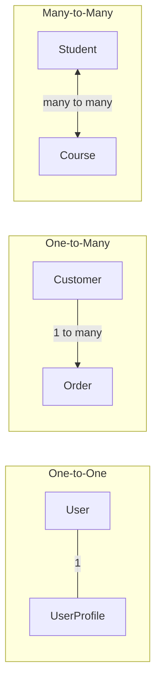
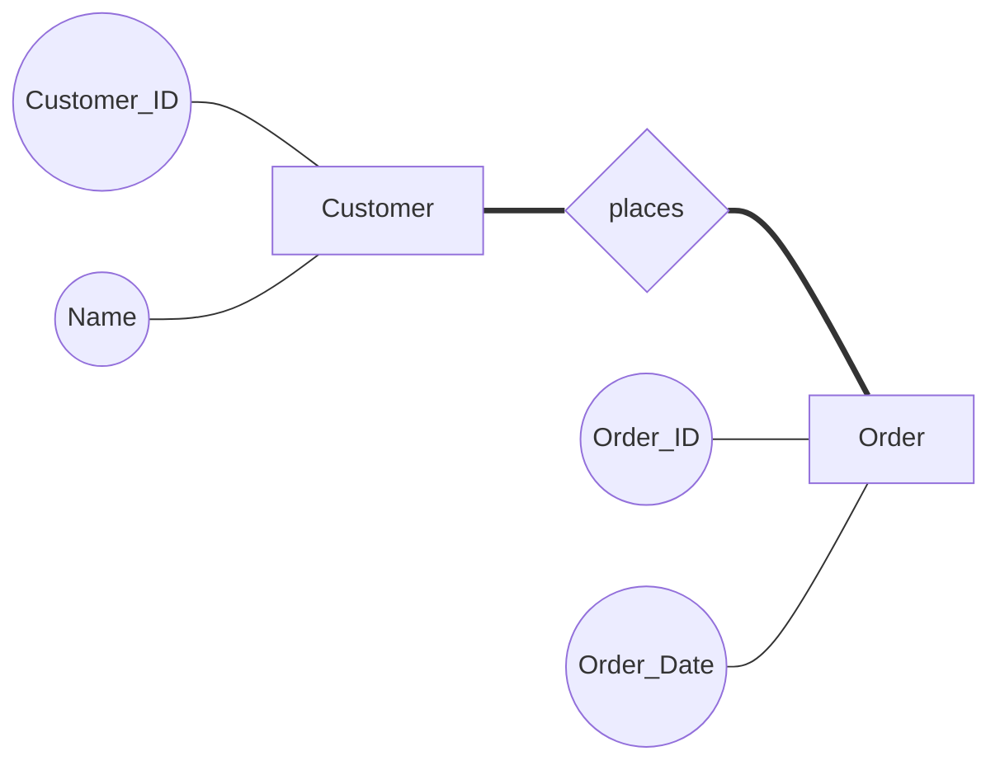
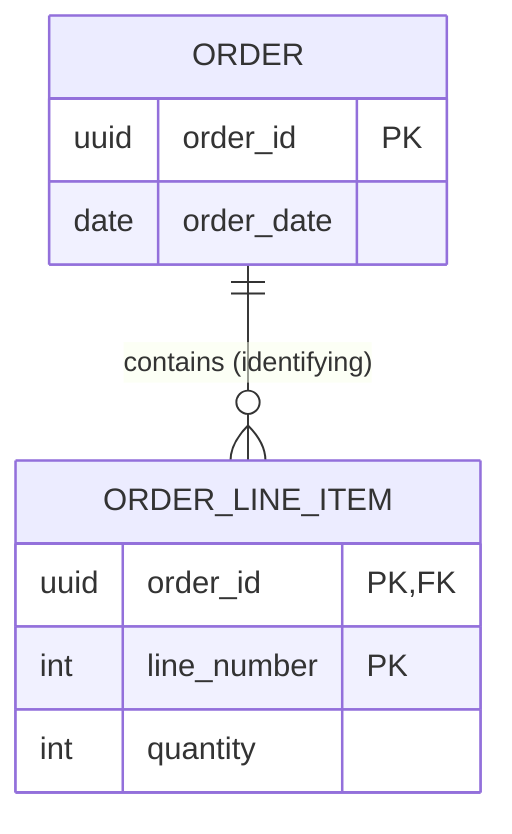
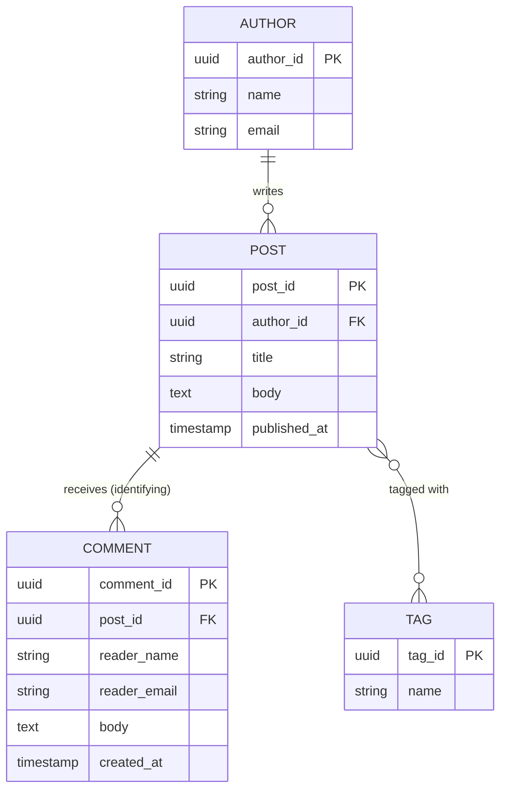

# Entity Relationship Diagrams (ERD): Importance and Usage

A complete, self-contained guide to understanding, reading, and drawing Entity Relationship Diagrams, the foundational tool for designing relational databases.

## Table of Contents

1. [What is an ERD?](#what-is-an-erd)
2. [Why ERDs Matter](#why-erds-matter)
3. [Where ERDs Are Used](#where-erds-are-used)
4. [Core Building Blocks](#core-building-blocks)
5. [Cardinality and Modality](#cardinality-and-modality)
6. [Notations: Chen vs Crow's Foot](#notations-chen-vs-crows-foot)
7. [Strong Entities, Weak Entities, and Identifying Relationships](#strong-entities-weak-entities-and-identifying-relationships)
8. [ERD Abstraction Levels: Conceptual, Logical, Physical](#erd-abstraction-levels-conceptual-logical-physical)
9. [How ERDs Relate to Normalization](#how-erds-relate-to-normalization)
10. [Step-by-Step: Building an ERD from Requirements](#step-by-step-building-an-erd-from-requirements)
11. [Worked Example: A Small Blog Platform](#worked-example-a-small-blog-platform)
12. [Tools for Creating ERDs](#tools-for-creating-erds)
13. [Comparisons: ERD vs Other Modeling Artifacts](#comparisons-erd-vs-other-modeling-artifacts)
14. [Common Pitfalls and Misconceptions](#common-pitfalls-and-misconceptions)
15. [Best Practices](#best-practices)
16. [Further Learning Path](#further-learning-path)
17. [References](#references)

---

## What is an ERD?

**Plain-language definition:** An Entity Relationship Diagram is a picture of the "things" your system needs to keep track of (customers, orders, products, and so on), the details you care about for each thing, and how those things connect to one another. It is the blueprint you draw before you build a database, in the same way an architect draws a floor plan before pouring a foundation.

**Precise/technical definition:** An ERD is a structural diagram used in database design that visually represents the entities (real-world objects or concepts) within a system, the attributes (properties) that describe each entity, and the relationships (associations, including their cardinality and participation constraints) that exist between entities. It was introduced by Peter Chen in his 1976 paper "The Entity-Relationship Model: Toward a Unified View of Data," which proposed the ER model as a way to unify the network and relational views of data.

An ERD is not a database itself. It is a modeling artifact, a diagram, that precedes and informs the creation of actual database tables, columns, and constraints.

## Why ERDs Matter

Every non-trivial application eventually needs to answer questions like: What data do we store? How is it related? What happens when a record is deleted? Answering these questions informally, in code or in someone's head, leads to inconsistent schemas, duplicated data, and bugs that only appear once real-world edge cases show up (a customer with two addresses, an order with no items, a product that belongs to multiple categories).

ERDs solve this by giving teams a shared, visual, unambiguous language for data structure before a single table is created. Specifically, ERDs matter because they:

- **Force early clarity.** Drawing the diagram surfaces missing requirements ("wait, can an order have zero line items?") long before those gaps become runtime bugs.
- **Serve as a communication bridge.** Business stakeholders, product managers, and engineers rarely share a common technical vocabulary, but almost everyone can read a box-and-line diagram. The ERD becomes the contract they all agree on.
- **Prevent data anomalies.** A well-modeled ERD, translated into a normalized schema, avoids insertion, update, and deletion anomalies (see [Normalization](#how-erds-relate-to-normalization)).
- **Reduce rework.** Changing a diagram costs minutes. Changing a production schema with live data, migrations, and dependent application code can cost days or weeks. ERDs are cheap to iterate on precisely because they carry no implementation weight yet.
- **Document the system for the long term.** Six months after launch, an ERD is often the fastest way for a new engineer to understand how the data fits together, faster than reverse-engineering it from `SELECT * FROM information_schema.columns`.

## Where ERDs Are Used

ERDs are not limited to greenfield database design. They show up throughout the software and data lifecycle:

- **Software engineering:** Designing the schema for a new application (SaaS products, e-commerce platforms, internal tools) before writing migrations.
- **Data engineering and analytics:** Modeling star schemas and fact/dimension tables in data warehouses (Snowflake, BigQuery, Redshift) before building ETL pipelines.
- **Enterprise architecture:** Documenting how systems of record (CRM, ERP, billing) relate to one another at a conceptual level, independent of any single database.
- **Healthcare and finance:** Industries with strict compliance and audit requirements use ERDs to demonstrate that sensitive data (patient records, transaction ledgers) is structured correctly and traceably.
- **Academic and interview settings:** ERDs are a standard part of database courses and are frequently used in technical interviews to assess a candidate's system design thinking.
- **Legacy system documentation:** Reverse-engineering an ERD from an existing, undocumented database (using tools that introspect a live schema) is a common first step when a team inherits an unfamiliar codebase.

## Core Building Blocks

Every ERD, regardless of notation, is built from three primitives.

### 1. Entities

An **entity** is a distinguishable object or concept in the domain, something you would store data about: a `Customer`, a `Product`, an `Order`, an `Invoice`. In a diagram, an entity is drawn as a rectangle. An **entity set** (sometimes called an entity type) is the collection of all instances of that entity, for example all rows that would eventually live in a `customers` table.

### 2. Attributes

An **attribute** is a property that describes an entity. Attributes come in several flavors, and understanding the distinctions matters because each one is handled differently when the ERD is translated into an actual schema.

| Attribute type | Definition | Example |
|---|---|---|
| Simple (atomic) | Cannot be meaningfully subdivided | `age`, `email` |
| Composite | Can be broken into smaller sub-attributes | `address` (street, city, zip) |
| Derived | Calculated from other attributes, not stored directly | `age` derived from `date_of_birth` |
| Multi-valued | Can hold more than one value for a single entity instance | `phone_numbers` for a customer |
| Key (identifier) | Uniquely identifies each entity instance | `customer_id`, `email` |

In Chen notation, simple attributes are ovals, composite attributes are ovals containing smaller ovals, derived attributes are dashed ovals, and multi-valued attributes are double ovals. Multi-valued attributes are a signal that a separate related entity is usually needed once you move to a logical schema (a customer's multiple phone numbers become a `phone_numbers` table, not a repeating column), because relational tables do not natively support columns that hold multiple values.

### 3. Relationships

A **relationship** describes how two (or more) entities are associated. Relationships are drawn as diamonds in Chen notation, or simply as labeled lines in Crow's Foot notation. A relationship can itself carry attributes: for example, an `enrolled_in` relationship between `Student` and `Course` might carry a `grade` attribute, which belongs to neither entity alone but to the fact of their association.

Relationships have a **degree**, describing how many entities participate:

- **Unary (recursive):** an entity relates to itself, for example an `Employee` who `manages` another `Employee`.
- **Binary:** the most common case, two entities related to each other, for example `Customer` `places` `Order`.
- **Ternary (or higher):** three or more entities participate in a single relationship, for example `Doctor`, `Patient`, and `Hospital` jointly participating in a `treats` relationship where the combination of all three matters.

## Cardinality and Modality

Once two entities are connected by a relationship, two further questions must be answered for each side of that relationship:

1. **Cardinality:** how many instances of one entity can be associated with how many instances of the other (one or many)?
2. **Modality (participation):** is the relationship optional or mandatory for each entity (zero or one, at minimum)?

Together these are often summarized as **(min, max)** pairs on each end of the relationship line. For example, "an Order must have exactly one Customer" is `(1,1)` on the Customer side of the relationship as seen from Order, while "a Customer may have zero or many Orders" is `(0,N)` on the Order side as seen from Customer.

### The Three Classic Cardinalities

| Cardinality | Meaning | Example |
|---|---|---|
| One-to-One (1:1) | Each instance of Entity A relates to at most one instance of Entity B, and vice versa | `User` has one `UserProfile` |
| One-to-Many (1:N) | One instance of Entity A relates to many instances of Entity B, but each instance of B relates to only one A | `Customer` places many `Orders`, each `Order` belongs to one `Customer` |
| Many-to-Many (M:N) | Many instances of Entity A relate to many instances of Entity B | `Student` enrolls in many `Courses`, each `Course` has many `Students` |

### Optional vs Mandatory (Modality)

Modality answers "does every instance need a partner, or can it exist alone?" A dashed or hollow-circle notation typically means optional (zero), while a solid tick mark or "1" means mandatory (one). This distinction matters enormously for implementation: a mandatory relationship usually becomes a `NOT NULL` foreign key, while an optional one allows `NULL`.

> **Important implementation note:** Many-to-many relationships cannot be directly represented as a single foreign key in a relational table. They require a **junction table** (also called a bridge table, associative table, or join table) that holds a foreign key to each side. A `student_courses` table with `student_id` and `course_id` is how the `Student`-`Course` many-to-many relationship above actually gets implemented.

## Notations: Chen vs Crow's Foot

There are two dominant notations for drawing ERDs. Both express the same underlying information; they differ in visual style and the audience they suit best.

### Chen Notation

Introduced alongside the ER model itself, Chen notation gives every concept its own distinct shape:

- **Rectangles** for entities
- **Ovals** for attributes (connected to their entity with a line)
- **Diamonds** for relationships (connected to the entities they relate)
- Cardinality is written as numbers or ranges (`1`, `N`, `1..*`) directly on the connecting lines

Chen notation is verbose but extremely explicit, which makes it well suited to teaching, academic papers, and early conceptual modeling where you want every attribute visible on the diagram itself.

### Crow's Foot Notation

Crow's Foot notation (also called information engineering notation) is more compact. Attributes live inside the entity rectangle rather than as separate shapes, and relationships are shown as plain lines between entities with special symbols at each end indicating cardinality and modality:

- A single tick mark: exactly one
- A crow's foot (three-pronged fork): many
- A circle: zero (optional)
- A crow's foot plus a tick mark: zero or many

Because it is more space-efficient and maps naturally onto real foreign-key relationships, Crow's Foot is the notation most commonly used in professional database design tools (dbdiagram.io, MySQL Workbench, Lucidchart, drawSQL) and in day-to-day engineering work. Mermaid's `erDiagram` syntax, used throughout this document, is a Crow's Foot-style notation.

### Side-by-Side Comparison

| Aspect | Chen Notation | Crow's Foot Notation |
|---|---|---|
| Entities | Rectangles | Rectangles (often with attribute list inside) |
| Attributes | Separate ovals connected by lines | Listed inside the entity box |
| Relationships | Diamonds, connected to entities | Lines directly between entities |
| Cardinality display | Numbers/labels on connecting lines | Symbols (tick marks, crow's feet, circles) at line ends |
| Verbosity | High, every element has its own shape | Low, compact and dense |
| Best for | Teaching, academic conceptual models | Professional tools, logical/physical schema design |
| Typical audience | Students, early-stage requirement gathering | Engineers, DBAs, technical stakeholders |

In practice, most engineering teams today draw and read Crow's Foot diagrams almost exclusively, but knowing Chen notation is useful because much of the foundational academic literature and many textbooks still use it.

## Strong Entities, Weak Entities, and Identifying Relationships

Not every entity can stand on its own.

- A **strong entity** (also called a regular entity) has its own key attribute that uniquely identifies each instance independent of any other entity. `Customer` with a `customer_id` is a strong entity.
- A **weak entity** has no key attribute of its own sufficient to uniquely identify its instances. It depends on a related strong entity (its "owner" or "identifying owner") for identification. A weak entity typically has a **partial key** (also called a discriminator), which only becomes unique when combined with the owner's key. Weak entities are drawn as a double-outlined rectangle in Chen notation.

  Classic example: an `OrderLineItem` might only be identifiable by `line_number` within the context of a specific `Order`. `line_number` alone (say, "3") is meaningless without knowing which order it belongs to. The true unique identifier is the composite of `(order_id, line_number)`.

- An **identifying relationship** is the relationship connecting a weak entity to its owning strong entity. It is drawn as a double-outlined diamond in Chen notation. When translated to a schema, the owner's primary key becomes part of the weak entity's own primary key (a composite key).
- A **non-identifying relationship** is the more common case: a regular foreign key relationship where the child entity has its own independent primary key and simply references the parent. If `Order` deletes its relationship to `Customer`, the `Order` row can still exist and be identified by its own `order_id`; it just loses its customer reference (or the deletion cascades, depending on business rules).

The practical rule of thumb: if an instance of Entity B is meaningless or non-unique without knowing its parent Entity A, B is weak and the relationship is identifying. If B can be uniquely identified and would still make sense as a standalone row even if disconnected from A, the relationship is non-identifying.

## ERD Abstraction Levels: Conceptual, Logical, Physical

ERDs are drawn at different levels of detail depending on the audience and the stage of the project. These three levels form a natural progression from "what does the business care about" to "what does the database engine actually store."

| Level | Purpose | Audience | Detail included |
|---|---|---|---|
| Conceptual | Capture business entities and their relationships at a high level | Business stakeholders, product managers, architects | Entity names, relationships, high-level cardinality. No attributes, no data types, no keys. |
| Logical | Define the structure of the data in implementation-agnostic terms | Data architects, senior engineers | All attributes, primary keys, foreign keys, full cardinality and modality. Still no database-specific types. |
| Physical | Represent the exact database implementation | DBAs, engineers writing migrations | Table names (often snake_case), column data types, indexes, constraints, partitioning, storage details, specific to one database engine (PostgreSQL, MySQL, and so on). |

A conceptual ERD for an e-commerce system might simply say "Customer places Order." The logical ERD adds that `Order` has `order_id`, `order_date`, `status`, and a foreign key to `Customer.customer_id`. The physical ERD specifies that `order_id` is a `uuid` with a default of `gen_random_uuid()`, `order_date` is a `timestamp with time zone`, `status` is a `text` column constrained to an enum of allowed values, and there is a b-tree index on the foreign key column.

Moving through these three levels deliberately, rather than jumping straight to physical design, is what prevents teams from prematurely locking in implementation details before the business requirements are actually well understood.

## How ERDs Relate to Normalization

Normalization is a separate, deeper topic (see `DATABASE_NORMALIZATION.md` in this repository for a full treatment), but it is worth understanding briefly how it connects to ERDs.

An ERD captures entities and relationships as the modeler perceives them from requirements. Normalization is the discipline of organizing the resulting relational tables to eliminate redundancy and avoid anomalies (data that becomes duplicated, inconsistent, or lost when rows are inserted, updated, or deleted). A well-drawn ERD, where every attribute genuinely belongs to the entity it is attached to and multi-valued or composite attributes have already been broken into their own entities, tends to produce a schema that is naturally close to Third Normal Form (3NF) once translated into tables. In other words, careful ER modeling and normalization are complementary techniques aimed at the same goal: a schema with minimal redundancy and maximal integrity. If you find yourself needing to normalize a schema significantly after drawing an ERD, it is often a sign that entities or attributes were not correctly separated during the ERD stage itself.

## Step-by-Step: Building an ERD from Requirements

1. **Gather requirements.** Read user stories, interview stakeholders, or review existing documentation to understand what the system needs to track and what questions it needs to answer.
2. **Identify entities (nouns).** Underline every noun in the requirements that represents a distinct "thing" the business cares about: customer, product, order, payment, warehouse. Be careful to distinguish true entities from attributes (a "shipping address" is usually an attribute or its own entity, not a separate top-level concept unless it needs independent tracking, such as multiple saved addresses per customer).
3. **Identify relationships (verbs).** Look for verbs connecting the nouns: a customer *places* an order, an order *contains* products, a product *belongs to* a category.
4. **Determine cardinality and modality for each relationship.** For each relationship, ask: how many of A relate to how many of B, and is participation mandatory or optional on each side? This is the step most often rushed, and rushing it is the single biggest source of downstream schema bugs.
5. **List attributes for each entity.** For every entity, list the properties that need to be stored. Identify the primary key (the attribute or attribute combination that uniquely identifies each instance).
6. **Resolve multi-valued and composite attributes.** If an attribute can hold multiple values (phone numbers, tags), promote it to its own entity connected by a one-to-many or many-to-many relationship. If an attribute is composite (an address), decide whether to keep it as sub-fields on the entity or split it into a related entity.
7. **Resolve many-to-many relationships into junction tables.** At the logical/physical level, introduce a bridge entity for every many-to-many relationship, carrying foreign keys to both sides (and any attributes that belong to the relationship itself, such as `enrolled_date` or `quantity`).
8. **Identify weak entities and identifying relationships.** Check whether any entity's instances only make sense in the context of a parent entity, and mark that relationship as identifying.
9. **Draw the diagram.** Use a consistent notation (Crow's Foot is recommended for anything beyond a teaching exercise) and a tool that fits your team's workflow.
10. **Validate against real scenarios.** Walk through actual use cases ("what happens when a customer is deleted but has existing orders?") and confirm the diagram supports them. Adjust cardinality, modality, or on-delete behavior as needed.
11. **Review with stakeholders.** Because the ERD is meant to be a shared communication artifact, have both technical and non-technical stakeholders review it before it is translated into migrations.
12. **Translate to a physical schema.** Convert entities to tables, attributes to columns with appropriate data types, primary keys to `PRIMARY KEY` constraints, and relationships to foreign keys with defined `ON DELETE` behavior.

## Worked Example: A Small Blog Platform

To make all of the above concrete, here is a small but complete domain: a blogging platform where authors write posts, posts can have many tags, and readers leave comments.

**Requirements gathered:**
- An author has a name and email, and writes zero or more posts.
- A post belongs to exactly one author, has a title, body, and a published date, and can have zero or more tags.
- A tag has a name and can be applied to many posts (many-to-many between posts and tags).
- A comment belongs to exactly one post and is written by exactly one reader (readers are simplified here to just a display name and email, and are not full user accounts).
- A comment cannot exist without a post (weak entity relative to Post) because a comment has no independent meaning outside the post it was left on.

**Entity and relationship analysis:**

| Entity | Key attribute | Notable attributes | Relationship |
|---|---|---|---|
| Author | author_id | name, email | writes 0..N Posts |
| Post | post_id | title, body, published_at | belongs to 1 Author, has 0..N Tags (M:N), has 0..N Comments |
| Tag | tag_id | name | applied to 0..N Posts (M:N) |
| PostTag (junction) | (post_id, tag_id) | -- | resolves Post-Tag M:N |
| Comment | comment_id | body, reader_name, reader_email, created_at | belongs to exactly 1 Post (identifying) |

**Mermaid ER diagram:**

Notice that the Mermaid `erDiagram` syntax automatically renders the Post-Tag many-to-many relationship (`}o--o{`) without requiring you to manually draw the junction table, though the junction table (`post_id`, `tag_id`) absolutely must exist in the physical schema. Some teams choose to draw the junction table explicitly in their ERD anyway, once they move from the conceptual to the logical or physical level, so the diagram matches the real tables one-to-one.

**Reading the cardinality symbols above:**
- `||--o{` between AUTHOR and POST: exactly one Author (mandatory) on the left, zero-to-many Posts (optional) on the right. An author can exist with zero posts, but every post must have exactly one author.
- `||--o{` between POST and COMMENT: exactly one Post (mandatory), zero-to-many Comments (optional). This is the identifying relationship: a comment's meaning is inseparable from its post.
- `}o--o{` between POST and TAG: zero-to-many on both sides, the classic many-to-many.

## Tools for Creating ERDs

| Tool | Style | Best for |
|---|---|---|
| [dbdiagram.io](https://dbdiagram.io) | Code-first (DBML syntax), renders live diagram | Developers who prefer typing schema as text and exporting SQL |
| [Lucidchart](https://www.lucidchart.com) | Drag-and-drop, general-purpose diagramming | Cross-functional teams, polished stakeholder presentations |
| [drawSQL](https://drawsql.app) | Web-based, collaborative, Crow's Foot | Teams wanting quick sharing and commenting on schema designs |
| [ERDPlus](https://erdplus.com) | Free, academic-focused | Learning ER modeling and relational algebra concepts |
| MySQL Workbench | Desktop GUI tied to MySQL | Reverse-engineering and forward-engineering MySQL schemas directly |
| draw.io (diagrams.net) | Free, self-hosted or browser-based, general diagramming | Teams wanting a free, flexible tool without vendor lock-in |
| Mermaid (`erDiagram`) | Markdown/code-based, renders natively in GitHub, GitLab, and many docs tools | Embedding diagrams directly in README files and technical documentation (as used throughout this document) |
| dbt (via `dbt docs generate`) | Auto-generated lineage/relationship graphs from models | Data teams documenting warehouse models, not a manual ERD tool but related |

For this repository's own schema (Drizzle ORM plus Neon Postgres), the most practical workflow is to maintain the ERD as a Mermaid diagram directly in Markdown documentation (as shown in this file), since it stays version-controlled alongside the schema code and renders automatically wherever the repository is viewed.

## Comparisons: ERD vs Other Modeling Artifacts

| Artifact | Purpose | Relationship to ERD |
|---|---|---|
| ERD | Visualizes entities, attributes, and relationships | The design-stage artifact this document covers |
| Relational schema (DDL) | The actual `CREATE TABLE` statements implementing the design | The physical-level ERD translated directly into SQL |
| UML class diagram | Models classes, methods, and object-oriented relationships (inheritance, composition) | Broader than an ERD; used for application object models, not purely data storage. Entities in an ERD roughly correspond to classes without behavior. |
| Data flow diagram (DFD) | Shows how data moves between processes, stores, and external entities | Complementary: a DFD shows movement, an ERD shows structure/relationships |
| Star schema / dimensional model | Optimized for analytics, with fact and dimension tables | A specialized, denormalized derivative often modeled using its own ERD-like diagrams, but designed for query performance over normalization |

## Common Pitfalls and Misconceptions

- **Treating an ERD as the schema itself.** An ERD is a design artifact. The actual database schema (data types, constraints, indexes) is a separate, more detailed translation of it, especially at the physical level.
- **Skipping modality.** Diagramming cardinality ("one-to-many") without specifying optionality ("must every order have a customer, or can orders exist unassigned?") leaves a critical ambiguity that later becomes a `NULL`-handling bug.
- **Forgetting many-to-many needs a junction table.** A raw many-to-many relationship cannot be implemented as a single foreign key column; it always requires a bridge/junction entity.
- **Modeling multi-valued attributes as repeating columns.** Fields like `phone_1`, `phone_2`, `phone_3` on a `Customer` table are a symptom of an unresolved multi-valued attribute that should have been split into its own entity during ERD design.
- **Confusing a weak entity with a low-importance entity.** "Weak" refers strictly to the lack of an independent unique identifier, not to how important the entity is to the business. A financial `Transaction` might be critically important yet still be a weak entity relative to its `Account`.
- **Over-modeling too early.** Adding every conceivable attribute and edge-case relationship at the conceptual stage slows stakeholder review. Conceptual ERDs should stay high-level; save exhaustive detail for the logical and physical levels.
- **Ignoring ternary relationships when they are actually needed.** Some relationships genuinely involve three entities jointly (not three separate binary relationships), and forcing them into pairs of binary relationships can lose meaning. For example, "a Doctor prescribes a Drug to a Patient" is a single ternary fact, not three independent binary ones.
- **Not validating the diagram against real scenarios.** A diagram that looks structurally correct can still fail the moment someone asks, "what happens when X is deleted?" Always walk through deletion, update, and edge-case scenarios before finalizing.

## Best Practices

- **Pick one notation and use it consistently across the team.** Mixing Chen and Crow's Foot symbols in the same diagram confuses readers.
- **Name entities as singular nouns** (`Customer`, not `Customers`) at the conceptual/logical level; the physical table name can follow your database's naming convention (commonly plural `snake_case`, such as `customers`).
- **Always specify cardinality and modality explicitly**, never leave a relationship line unlabeled.
- **Model the "why," not just the "what."** Add short annotations to non-obvious relationships (why is this identifying? why is this optional?) so future readers do not have to guess.
- **Keep conceptual, logical, and physical versions in sync**, or clearly version and date each one so nobody references a stale conceptual diagram as if it were the current physical schema.
- **Version-control your ERDs alongside your schema code.** Text-based formats (Mermaid, DBML) diff cleanly in pull requests, unlike binary diagram files.
- **Review the ERD with both technical and non-technical stakeholders** before writing migrations. Catching a misunderstood requirement on a diagram costs minutes; catching it after data has been loaded into production tables can cost days.
- **Revisit the ERD whenever the schema changes.** A diagram that drifts out of sync with the real database becomes actively misleading, worse than having no diagram at all.
- **Use junction tables even for "simple" many-to-many relationships**, and give them meaningful names (`post_tags`, `student_courses`) rather than generic names like `bridge1`.
- **Cross-reference this project's own database rules** (`.claude/rules/database.md`) once you move from a general ERD into this repository's actual Drizzle schema, since this project layers additional requirements on top of standard ERD practice (mandatory `tenant_id` on every table, UUIDv7 primary keys, and Row Level Security policies).

## Further Learning Path

1. Start with this document to internalize entities, attributes, relationships, cardinality, and notation.
2. Practice by modeling a small, familiar domain (a library, a movie rental system, a simple task tracker) from scratch using Crow's Foot notation.
3. Study relational database normalization (1NF through 3NF, and BCNF) to understand how a well-formed ERD translates into a well-formed schema. See `DATABASE_NORMALIZATION.md` in this repository.
4. Learn how foreign keys, indexes, and `ON DELETE` behaviors are actually implemented in your target database engine (PostgreSQL, in this project's case).
5. Explore Drizzle ORM's schema definition syntax and this project's own `.claude/rules/database.md` to see how conceptual ER modeling maps onto this codebase's multi-tenant, RLS-enforced schema conventions.
6. Study dimensional modeling (star and snowflake schemas) if you move into analytics or data warehouse work, since it is a specialized variant of ER modeling optimized for read-heavy analytical queries rather than transactional integrity.
7. Practice reverse-engineering ERDs from existing databases (using a tool like MySQL Workbench, DBeaver, or `dbdocs`) to build the skill of reading unfamiliar schemas quickly.

## References

**User-provided:**
- [Entity Relationship Diagrams (YouTube)](https://www.youtube.com/watch?v=LowjDtiNlk4), an introductory tutorial on ERDs published December 2024. The video's transcript could not be directly retrieved during research, so this document was independently verified and expanded using the additional sources below to ensure the same core topics (entities, attributes, relationships, cardinality) are covered accurately and in depth.

**Independent research:**
- [ER Notation Basic Diagram Wiki (ConceptDraw)](https://www.conceptdraw.com/examples/er-notation-basic-daigram-wiki)
- [Entity Relationship Diagram (ERD): What is an ER Diagram? (SmartDraw)](https://www.smartdraw.com/entity-relationship-diagram/)
- [Easy Guide to Chen Notation for Entity-Relationship Diagrams (Creately)](https://creately.com/guides/chen-notation-in-erd/)
- [Chen Notation and Crow's Foot (Gleek)](https://www.gleek.io/er-diagrams)
- [Guide to Entity-Relationship Diagram Notations and Symbols (Gleek)](https://www.gleek.io/blog/er-symbols-notations)
- [Crow's Foot vs. Chen Notation: Detailed Comparison (Gleek)](https://www.gleek.io/blog/crows-foot-chen)
- [ERD Alternatives and Variations, A Practical Introduction to Databases (Runestone Academy)](https://runestone.academy/ns/books/published/practical_db/PART2_DATA_MODELING/04-other-notations/other-notations.html)
- [Weak Entity (Wikipedia)](https://en.wikipedia.org/wiki/Weak_entity)
- [Difference Between Identifying and Non-Identifying Relationships (GeeksforGeeks)](https://www.geeksforgeeks.org/dbms/difference-between-identifying-and-non-identifying-relationships/)
- [ERD Basic Components (OpenDSA / Virginia Tech)](https://opendsa.cs.vt.edu/ODSA/Books/Database/html/ERDComponents.html)
- [Data Modeling: Conceptual vs Logical vs Physical Data Model (Visual Paradigm)](https://online.visual-paradigm.com/knowledge/visual-modeling/conceptual-vs-logical-vs-physical-data-model)
- [The Differences Between Conceptual, Logical, and Physical Data Models (Couchbase)](https://www.couchbase.com/blog/conceptual-physical-logical-data-models/)
- [Types of Entity Relationship Diagrams with Examples (Creately)](https://creately.com/guides/types-of-erd/)
- [Best ER Diagram Tools in 2025: A Developer's Comparison (ER Flow)](https://erflow.io/en/blog/best-er-diagram-tools-2025)
- [Best ERD and Database Design Tools 2026 (TalkingSchema)](https://talkingschema.ai/blog/best-erd-database-design-tools-2026)
- [10 Best ERD Tools for Better Visualizing Your Data (ChartDB)](https://chartdb.io/blog/best-free-erd-tools)

**Project-internal references:**
- `.claude/rules/database.md`, this repository's own Drizzle ORM, multi-tenancy, and Row Level Security conventions, relevant once an ERD is translated into this project's actual schema.
- `DATABASE_NORMALIZATION.md`, this repository's companion document on normalization, referenced in the [Further Learning Path](#further-learning-path).